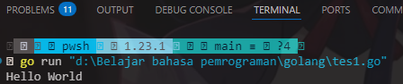

# <h1 align="center">Laporan Praktikum Modul 01 <br> Running Modul</h1>
<p align="end">Wahyu Widodo - 103112430011 <br>12-IF-05</p>

## Dasar Teori

Menampilkan print Hello World


```go
package main

func main() {
	fmt.Print("Hello World")
}
```

> Output
> 

Program ini menampilkan hello world

