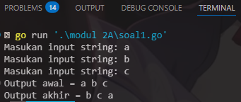
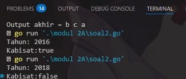
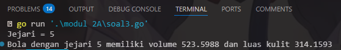
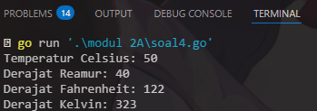
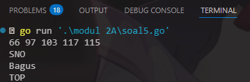

# <h1 align="center">Laporan Praktikum Modul 02 <br> Review Pengenalan Pemrograman</h1>
<p align="center">Wahyu Widodo - 103112430011</p>

## Dasar Teori

Mengulang kembali materi Tipe Data, Percabangan, dan Struktur kontrol looping.

## Unguided

### Soal 1

copy paste soal nomor 1 disini

```go
package main

func main() {
	fmt.Println("Kode kalian disini")
	fmt.Println("JANGAN MASUKIN >>SCREENSHOT<< KODE KALIAN DISINI")
	fmt.Println("KALAU ADA -20 POIN LAPRAK")
}
```

> Output
> 
> %% Untuk mencantumkan screenshot, tidak boleh ada spasi di urlnya `()`, penamaan file bebas asal gak sara dan mudah dipahami aja,, dan jangan lupa hapus komen ini yah%%

Penjelasan ttg kode kalian disini

### Soal 2A

1. Telusuri program berikut dengan cara mengkompilasi dan mengeksekusi program.
Silakan masukan data yang sesuai sebanyak yang diminta program. Perhatikan keluaran
yang diperoleh. Coba terangkan apa sebenarnya yang dilakukan program tersebut?

```go
package main
import "fmt"

func main() {
    var (
        satu, dua, tiga string
        temp string
    )

    fmt.Print("Masukan input string: ")
    fmt.Scanln(&satu)
    fmt.Print("Masukan input string: ")
    fmt.Scanln(&dua)
    fmt.Print("Masukan input string: ")
    fmt.Scanln(&tiga)
    fmt.Println("Output awal = " + satu + " " + dua + " " + tiga)

    temp = satu
    satu = dua
    dua = tiga
    tiga = temp

    fmt.Println("Output akhir = " + satu + " " + dua + " " + tiga)

}
```

> Output <br>
> 

Penjelasan kode
Program melakukan pertukaran 3 nilai variabel string yg dimasukkan oleh pengguna. Proses program dalam melakukan pertukaran nilai 3 variable adalah sebagai berikut:
 1. variable temp menyimpan nilai satu
 2. variable satu diisi dengan nilai dari dua
 3. variable dua diisi dengan nilai dari tiga
 4. variable tiga diisi dengan nilai dari temp (nilai asli dari satu)
<br>

2. Tahun kabisat adalah tahun yang habis dibagi 400 atau habis dibagi 4 tetapi tidak habis
dibagi 100. Buatlah sebuah program yang menerima input sebuah bilangan bulat dan
memeriksa apakah bilangan tersebut merupakan tahun kabisat (true) atau bukan (false).

```go
package main

import "fmt"

func main() {
	var tahun int
	var kabisat bool
	fmt.Print("Tahun: ")
	fmt.Scan(&tahun)
	if (tahun%400 == 0) || (tahun%4 == 0 && tahun%100 != 0) {
		kabisat = true
	} else {
		kabisat = false
	}

	fmt.Print("Kabisat:", kabisat)
}
```

> Output <br>
> 

Penjelasan kode
Program melakukan pengecekan apakah tahun itu merupakan tahun kabisat dengan cara apakah tahun yang diinput habis dibagi 400 atau habis di bagi 4 tetapi tidak habis dibagi 100 dengan menggunakan mod(modulus). Jika semua kondisi terpenuhi maka tahun itu termasuk kabisat sedangkan kalo tidak terpenuhi (ada sisa bagi) maka tahun itu bukan termasuk tahun kabisat.
<br>
3. Buat program Bola yang menerima input jari-jari suatu bola (bilangan bulat). Tampilkan
Volume dan Luas kulit bola. 𝑣𝑜𝑙𝑢𝑚𝑒𝑏𝑜𝑙𝑎 = 4/3 𝜋𝑟 3 dan 𝑙𝑢𝑎𝑠𝑏𝑜𝑙𝑎 = 4𝜋𝑟 2 
(π ≈ 3.1415926535).

```go
package main

import (
	"fmt"
	"math"
)

func main() {
	var r, volume, luas float64
	const pi = 3.1415926535

	fmt.Print("Jejari = ")
	fmt.Scanln(&r)

	volume = (4.0 / 3.0) * pi * math.Pow(r, 3)
	luas = 4 * pi * math.Pow(r, 2)

	fmt.Printf("Bola dengan jejari %.0f memiliki volume %.4f dan luas kulit %.4f\n", r, volume, luas)
}
```

> Output <br>
> 

Penjelasan kode
Program melakukan perhitungan volume dan luas bola dengan menggunakan rumus yang sudah ada disoal dan menggunakan package tambahan yaitu math untuk mempermudah menghitung pangkat 2 dan pangkat 3. 
<br>
4. Dibaca nilai temperatur dalam derajat Celsius. Nyatakan temperatur tersebut dalam 
Fahrenheit
𝐶𝑒𝑙𝑠𝑖𝑢𝑠 = (𝐹𝑎ℎ𝑟𝑒𝑛ℎ𝑒𝑖𝑡 − 32) × 5/9
𝑅𝑒𝑎𝑚𝑢𝑟 = 𝐶𝑒𝑙𝑐𝑖𝑢𝑠 × 4/5
𝐾𝑒𝑙𝑣𝑖𝑛 = (𝐹𝑎ℎ𝑟𝑒𝑛ℎ𝑒𝑖𝑡 + 459.67) × 5/9

```go
package main

import "fmt"

func main() {
	var celsius, fahrenheit, reamur, kelvin float64

	fmt.Print("Temperatur Celsius: ")
	fmt.Scanln(&celsius)

	fahrenheit = (celsius * 9 / 5) + 32
	reamur = celsius * 4 / 5
	kelvin = (fahrenheit + 459.67) * 5 / 9

	fmt.Printf("Derajat Reamur: %.0f\n", reamur)
	fmt.Printf("Derajat Fahrenheit: %.0f\n", fahrenheit)
	fmt.Printf("Derajat Kelvin: %.0f\n", kelvin)
}
```

> Output <br>
> 

Penjelasan kode
Program diatas digunakan untuk konversi suhu. Program menerima input Temperatur Celcius dan kemudian program melakukan Konversi dari Celcius ke derajar Reamur, derajat Fahrenheit, dan derajat Kelvin. 

<br>
5. Tipe karakter sebenarnya hanya apa yang tampak dalam tampilan. Di dalamnya 
tersimpan dalam bentuk biner 8 bit (byte) atau 32 bit (rune) saja. Buat program ASCII yang akan membaca 5 buat data integer dan mencetaknya dalam format karakter. Kemudian membaca 3 buah data karakter dan mencetak 3 buah karakter setelah karakter tersebut (menurut tabel ASCII)

```go
package main

import "fmt"

func main() {
	var a, b, c, d, e int
	var x, y, z byte

	fmt.Scan(&a, &b, &c, &d, &e)
	fmt.Scanf("\n%c%c%c", &x, &y, &z)
	fmt.Printf("%c%c%c%c%c\n", a, b, c, d, e)
	fmt.Printf("%c%c%c\n", x+1, y+1, z+1)
}
```

> Output <br>
> 

Penjelasan kode
Program ini menerima 5 input angka integer dan tiga karakter. Lalu program mengubah angka integer menjadi karakter ASCII dan langsung menampilkan ke layar. Program juga melakukan increment(+1) pada variable byte x,y,x untuk menggeser huruf nya.
