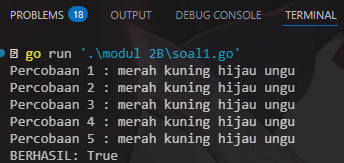
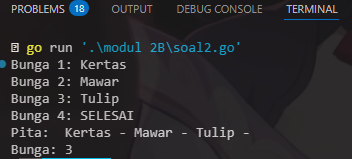
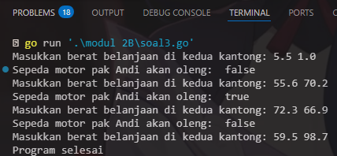
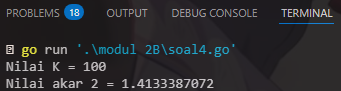

# <h1 align="center">Laporan Praktikum Modul 02 <br> Review Pengenalan Pemrograman</h1>
<p align="center">Wahyu Widodo - 103112430011</p>

## Dasar Teori

Dasar teori pemrograman mencakup tiga konsep utama: Tipe Data, Percabangan, dan Struktur Kontrol Looping. **Tipe Data** menentukan jenis nilai yang dapat disimpan dalam variabel, seperti integer, float, string, dan boolean. **Percabangan** memungkinkan program mengambil keputusan berdasarkan kondisi tertentu, menggunakan struktur seperti if-else. **Struktur Kontrol Looping** digunakan untuk menjalankan blok kode secara berulang hingga kondisi tertentu terpenuhi, dengan perulangan seperti for, while, dan repeat-until, yang membantu melakukan tugas yang berulang dalam pemrograman.
## Unguided

### Soal 1

copy paste soal nomor 1 disini

```go
package main

func main() {
	fmt.Println("Kode kalian disini")
	fmt.Println("JANGAN MASUKIN >>SCREENSHOT<< KODE KALIAN DISINI")
	fmt.Println("KALAU ADA -20 POIN LAPRAK")
}
```

> Output
> 
> %% Untuk mencantumkan screenshot, tidak boleh ada spasi di urlnya `()`, penamaan file bebas asal gak sara dan mudah dipahami aja,, dan jangan lupa hapus komen ini yah%%

Penjelasan ttg kode kalian disini

### Soal 2A

1. Telusuri program berikut dengan cara mengkompilasi dan mengeksekusi program.
Silakan masukan data yang sesuai sebanyak yang diminta program. Perhatikan keluaran
yang diperoleh. Coba terangkan apa sebenarnya yang dilakukan program tersebut?

```go
package main
import "fmt"

func main() {
    var (
        satu, dua, tiga string
        temp string
    )

    fmt.Print("Masukan input string: ")
    fmt.Scanln(&satu)
    fmt.Print("Masukan input string: ")
    fmt.Scanln(&dua)
    fmt.Print("Masukan input string: ")
    fmt.Scanln(&tiga)
    fmt.Println("Output awal = " + satu + " " + dua + " " + tiga)

    temp = satu
    satu = dua
    dua = tiga
    tiga = temp

    fmt.Println("Output akhir = " + satu + " " + dua + " " + tiga)

}
```

> Output <br>
> 

Program melakukan pertukaran 3 nilai variabel string yg dimasukkan oleh pengguna. Proses program dalam melakukan pertukaran nilai 3 variable adalah sebagai berikut:
 1. variable temp menyimpan nilai satu
 2. variable satu diisi dengan nilai dari dua
 3. variable dua diisi dengan nilai dari tiga
 4. variable tiga diisi dengan nilai dari temp (nilai asli dari satu)
<br>

2. Tahun kabisat adalah tahun yang habis dibagi 400 atau habis dibagi 4 tetapi tidak habis
dibagi 100. Buatlah sebuah program yang menerima input sebuah bilangan bulat dan
memeriksa apakah bilangan tersebut merupakan tahun kabisat (true) atau bukan (false).

```go
package main

import "fmt"

func main() {
	var tahun int
	var kabisat bool
	fmt.Print("Tahun: ")
	fmt.Scan(&tahun)
	if (tahun%400 == 0) || (tahun%4 == 0 && tahun%100 != 0) {
		kabisat = true
	} else {
		kabisat = false
	}

	fmt.Print("Kabisat:", kabisat)
}
```

> Output <br>
> 

Program melakukan pengecekan apakah tahun itu merupakan tahun kabisat dengan cara apakah tahun yang diinput habis dibagi 400 atau habis di bagi 4 tetapi tidak habis dibagi 100 dengan menggunakan mod(modulus). Jika semua kondisi terpenuhi maka tahun itu termasuk kabisat sedangkan kalo tidak terpenuhi (ada sisa bagi) maka tahun itu bukan termasuk tahun kabisat.

<br>
3. Buat program Bola yang menerima input jari-jari suatu bola (bilangan bulat). Tampilkan
Volume dan Luas kulit bola. 𝑣𝑜𝑙𝑢𝑚𝑒𝑏𝑜𝑙𝑎 = 4/3 𝜋𝑟 3 dan 𝑙𝑢𝑎𝑠𝑏𝑜𝑙𝑎 = 4𝜋𝑟 2 
(π ≈ 3.1415926535).

```go
package main

import (
	"fmt"
	"math"
)

func main() {
	var r, volume, luas float64
	const pi = 3.1415926535

	fmt.Print("Jejari = ")
	fmt.Scanln(&r)

	volume = (4.0 / 3.0) * pi * math.Pow(r, 3)
	luas = 4 * pi * math.Pow(r, 2)

	fmt.Printf("Bola dengan jejari %.0f memiliki volume %.4f dan luas kulit %.4f\n", r, volume, luas)
}
```

> Output <br>
> 

Program melakukan perhitungan volume dan luas bola dengan menggunakan rumus yang sudah ada disoal dan menggunakan package tambahan yaitu math untuk mempermudah menghitung pangkat 2 dan pangkat 3. 

<br>
4. Dibaca nilai temperatur dalam derajat Celsius. Nyatakan temperatur tersebut dalam 
Fahrenheit
𝐶𝑒𝑙𝑠𝑖𝑢𝑠 = (𝐹𝑎ℎ𝑟𝑒𝑛ℎ𝑒𝑖𝑡 − 32) × 5/9
𝑅𝑒𝑎𝑚𝑢𝑟 = 𝐶𝑒𝑙𝑐𝑖𝑢𝑠 × 4/5
𝐾𝑒𝑙𝑣𝑖𝑛 = (𝐹𝑎ℎ𝑟𝑒𝑛ℎ𝑒𝑖𝑡 + 459.67) × 5/9

```go
package main

import "fmt"

func main() {
	var celsius, fahrenheit, reamur, kelvin float64

	fmt.Print("Temperatur Celsius: ")
	fmt.Scanln(&celsius)

	fahrenheit = (celsius * 9 / 5) + 32
	reamur = celsius * 4 / 5
	kelvin = (fahrenheit + 459.67) * 5 / 9

	fmt.Printf("Derajat Reamur: %.0f\n", reamur)
	fmt.Printf("Derajat Fahrenheit: %.0f\n", fahrenheit)
	fmt.Printf("Derajat Kelvin: %.0f\n", kelvin)
}
```

> Output <br>
> 

Program diatas digunakan untuk konversi suhu. Program menerima input Temperatur Celcius dan kemudian program melakukan Konversi dari Celcius ke derajar Reamur, derajat Fahrenheit, dan derajat Kelvin. 

<br>
5. Tipe karakter sebenarnya hanya apa yang tampak dalam tampilan. Di dalamnya 
tersimpan dalam bentuk biner 8 bit (byte) atau 32 bit (rune) saja. Buat program ASCII yang akan membaca 5 buat data integer dan mencetaknya dalam format karakter. Kemudian membaca 3 buah data karakter dan mencetak 3 buah karakter setelah karakter tersebut (menurut tabel ASCII)

```go
package main

import "fmt"

func main() {
	var a, b, c, d, e int
	var x, y, z byte

	fmt.Scan(&a, &b, &c, &d, &e)
	fmt.Scanf("\n%c%c%c", &x, &y, &z)
	fmt.Printf("%c%c%c%c%c\n", a, b, c, d, e)
	fmt.Printf("%c%c%c\n", x+1, y+1, z+1)
}
```

> Output <br>
> 

Program ini menerima 5 input angka integer dan tiga karakter. Lalu program mengubah angka integer menjadi karakter ASCII dan langsung menampilkan ke layar. Program juga melakukan increment(+1) pada variable byte x,y,x untuk menggeser huruf nya.


<br>
## Soal 2B

1. Siswa kelas IPA di salah satu sekolah menengah atas di Indonesia sedang mengadakan 
praktikum kimia. Di setiap percobaan akan menggunakan 4 tabung reaksi, yang mana 
susunan warna cairan di setiap tabung akan menentukan hasil percobaan. Siswa diminta 
untuk mencatat hasil percobaan tersebut. Percobaan dikatakan berhasil apabila susunan 
warna zat cair pada gelas 1 hingga gelas 4 secara berturutan adalah ‘merah’, ‘kuning’, 
‘hijau’, dan ‘ungu’ selama 5 kali percobaan berulang.
Buatlah sebuah program yang menerima input berupa warna dari ke 4 gelas reaksi 
sebanyak 5 kali percobaan. Kemudian program akan menampilkan true apabila urutan 
warna sesuai dengan informasi yang diberikan pada paragraf sebelumnya, dan false
untuk urutan warna lainnya.

```go
package main

import "fmt"

func main() {
	var w1, w2, w3, w4 string
	var Urut = true
	for i := 1; i <= 5; i++ {
		fmt.Printf("Percobaan %d : ", i)
		fmt.Scanln(&w1, &w2, &w3, &w4)
		if w1 != "merah" || w2 != "kuning" || w3 != "hijau" || w4 != "ungu" {
			Urut = false
		}
	}

	if Urut {
		fmt.Println("BERHASIL: True")
	} else {
		fmt.Println("BERHASIL: False")
	}
}
```

> Output <br>
> 

Program melakukan pertukaran 3 nilai variabel string yg dimasukkan oleh pengguna. Proses program dalam melakukan pertukaran nilai 3 variable adalah sebagai berikut:
 1. variable temp menyimpan nilai satu
 2. variable satu diisi dengan nilai dari dua
 3. variable dua diisi dengan nilai dari tiga
 4. variable tiga diisi dengan nilai dari temp (nilai asli dari satu)
<br>

2. Suatu pita (string) berisi kumpulan nama-nama bunga yang dipisahkan oleh spasi dan ‘–‘, contoh pita diilustrasikan seperti berikut ini.
Pita: mawar – melati – tulip – teratai – kamboja – anggrek
Buatlah sebuah program yang menerima input sebuah bilangan bulat positif (dan tidak 
nol) N, kemudian program akan meminta input berupa nama bunga secara berulang 
sebanyak N kali dan nama tersebut disimpan ke dalam pita.
(Petunjuk: gunakan operasi penggabungan string dengan operator “+” ).
Tampilkan isi pita setelah proses input selesai.

```go
package main

import "fmt"

func main() {
	var i, banyak_bunga int
	var bunga, pita string
	i = 1
	banyak_bunga = 0
	for bunga != "SELESAI" {
		fmt.Printf("Bunga %d: ", i)
		fmt.Scan(&bunga)
		if bunga != "SELESAI" {
			pita += bunga + " - "
			i++
			banyak_bunga++
		}
	}
	fmt.Println("Pita: ", pita)
	fmt.Print("Bunga: ", banyak_bunga)
}
```

> Output <br>
> 

Program melakukan pengecekan apakah tahun itu merupakan tahun kabisat dengan cara apakah tahun yang diinput habis dibagi 400 atau habis di bagi 4 tetapi tidak habis dibagi 100 dengan menggunakan mod(modulus). Jika semua kondisi terpenuhi maka tahun itu termasuk kabisat sedangkan kalo tidak terpenuhi (ada sisa bagi) maka tahun itu bukan termasuk tahun kabisat.

<br>
3. Setiap hari Pak Andi membawa banyak barang belanjaan dari pasar dengan mengendarai sepeda motor. Barang belanjaan tersebut dibawa dalam kantong terpal di kiri-kanan motor. Sepeda motor tidak akan oleng jika selisih berat barang di kedua kantong sisi tidak lebih dari 9 kg. Buatlah program Pak Andi yang menerima input dua buah bilangan real positif yang menyatakan berat total masing-masing isi kantong terpal. Program akan terus meminta input bilangan tersebut hingga salah satu kantong terpal berisi 9 kg atau lebih

```go
package main

import "fmt"

func main() {
	var berat_kiri, berat_kanan, total_berat float64
	var oleng = false
	for total_berat < 150 {
		fmt.Printf("Masukkan berat belanjaan di kedua kantong: ")
		fmt.Scanln(&berat_kiri, &berat_kanan)
		selisih := berat_kiri - berat_kanan
		if selisih < 0 {
			selisih = -selisih 
		}
		oleng = selisih >= 9
		total_berat = berat_kiri + berat_kanan
		if total_berat < 150 {
			fmt.Println("Sepeda motor pak Andi akan oleng: ", oleng)
		}
	}
	fmt.Println("Program selesai")
}
```

> Output <br>
> 

Program melakukan perhitungan volume dan luas bola dengan menggunakan rumus yang sudah ada disoal dan menggunakan package tambahan yaitu math untuk mempermudah menghitung pangkat 2 dan pangkat 3. 

<br>
4. Diberikan sebuah persamaan sebagai berikut ini.
(4𝑘 + 2)^2
𝑓(𝑘) =(4𝑘 + 1)/(4𝑘 + 3)
Buatlah sebuah program yang menerima input sebuah bilangan sebagai K, kemudian 
menghitung dan menampilkan nilai f(K) sesuai persamaan di atas.

```go
package main

import "fmt"

func main() {
	var k int
	var pembilang, penyebut, hasil float64
	const faktor1 = 4
	const faktor2 = 2

	fmt.Print("Nilai K = ")
	fmt.Scan(&k)

	hasil = 1.0

	for i := 0; i <= k; i++ {
		pembilang = float64((faktor1*i + faktor2) * (faktor1*i + faktor2))
		penyebut = float64((faktor1*i + 1) * (faktor1*i + 3))
		hasil *= pembilang / penyebut
	}

	fmt.Printf("Nilai akar 2 = %.10f\n", hasil)
}
```

> Output <br>
> 

Program diatas digunakan untuk konversi suhu. Program menerima input Temperatur Celcius dan kemudian program melakukan Konversi dari Celcius ke derajar Reamur, derajat Fahrenheit, dan derajat Kelvin. 
