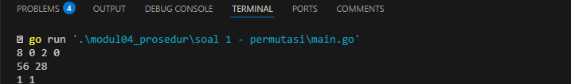
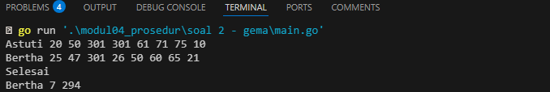
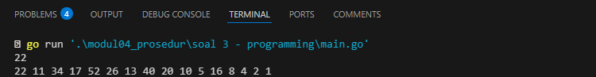

# <h1 align="center">Laporan Praktikum Modul 04 <br> Prosedur</h1>
<p align="center">Wahyu Widodo - 103112430011</p>

## Dasar Teori

Prosedur dalam pemrograman adalah sebuah blok kode yang digunakan untuk menjalankan serangkaian instruksi tertentu secara terorganisir. Prosedur memungkinkan pemrogram untuk menghindari pengulangan kode dan membuat program lebih modular, terstruktur, serta mudah untuk dipahami dan dikelola. Berbeda dengan fungsi prosedur tidak mengembalikan nilai dan hanya menjalankan tugas tertentu.

## Unguided

### Soal 1

Minggu ini, mahasiswa Fakultas Informatika mendapatkan tugas dari mata kuliah matematika diskrit untuk mempelajari kombinasi dan permutasi. Jonas salah seorang mahasiswa, iseng untuk mengimplementasikannya ke dalam suatu program. Oleh karena itu bersediakah kalian membantu Jonas? (tidak tentunya ya :p)

```go
package main

import "fmt"

func factorial(n int, hasil *int) {
	*hasil = 1
	for i := 2; i <= n; i++ {
		*hasil *= i
	}
}

func permutation(n, r int, hasil *int) {
	var faktorN, faktorNR int
	factorial(n, &faktorN)
	factorial(n-r, &faktorNR)
	*hasil = faktorN / faktorNR
}

func combination(n, r int, hasil *int) {
	var faktorN, faktorR, faktorNR int
	factorial(n, &faktorN)
	factorial(r, &faktorR)
	factorial(n-r, &faktorNR)
	*hasil = faktorN / (faktorR * faktorNR)
}

func main() {
	var a, b, c, d int
	var Pac, Kac, Pbd, Kbd int

	fmt.Scan(&a, &b, &c, &d)
	permutation(a, c, &Pac)
	combination(a, c, &Kac)
	permutation(b, d, &Pbd)
	combination(b, d, &Kbd)

	fmt.Println(Pac, Kac)
	fmt.Println(Pbd, Kbd)
}

```

> Output <br>
> 

Program ini melakukan perhitungan permutasi dan kombinasi. Terdapat 3 prosedur yang pertama ada prosedur faktorial digunakan untuk menghitung hasil faktor yang digunakan untuk mencari permutasi dan kombinasi. Didalam prosedur faktorial terdapat looping yang digunakan untuk menghitung faktorial menggunakan perulangan dari 2 sampai n dengan mengalikan nya satu persatu. Didalam prosedur permutasi terdapat rumus yaitu n!/n-r! untuk mengitung permutasi nya. Yang terakhir didalm prosedur kombinasi terdapat rumus n!/r!(n-r)! untuk hitung kombinasi nya. Lalu prosedur tidak akan berguna jika tidak di panggil di main program, untuk memanggil nya cukup ketikan nama prosedurnya beserta parameter yang dibutuh kan, untuk mendapatkan parameter yang dimana adalah input dari user maka ada fmt.Scan 
<br>
### Soal 2

Kompetisi pemrograman tingkat nasional berlangsung ketat. Setiap peserta diberikan 8 soal yang harus dapat diselesaikan dalam waktu 5 jam saja. Peserta yang berhasil menyelesaikan soal paling banyak dalam waktu paling singkat adalah pemenangnya.
Buat program gema yang mencari pemenang dari daftar peserta yang diberikan. Program 
harus dibuat modular, yaitu dengan membuat prosedur hitungSkor yang mengembalikan total soal dan total skor yang dikerjakan oleh seorang peserta, melalui parameter formal. 
Pembacaan nama peserta dilakukan di program utama, sedangkan waktu pengerjaan dibaca di dalam prosedur. prosedure hitungSkor(in/out soal, skor : integer) Setiap baris masukan dimulai dengan satu string nama peserta tersebut diikuti dengan adalah 
8 integer yang menyatakan berapa lama (dalam menit) peserta tersebut menyelesaikan soal. Jika tidak berhasil atau tidak mengirimkan jawaban maka otomatis dianggap menyelesaikan dalam waktu 5 jam 1 menit (301 menit). Satu baris keluaran berisi nama pemenang, jumlah soal yang diselesaikan, dan nilai yang diperoleh. Nilai adalah total waktu yang dibutuhkan untuk menyelesaikan soal yang berhasil diselesaikan.

```go
package main

import "fmt"

func hitungSkor(totalSoal *int, totalSkor *int) {
	*totalSoal = 0
	*totalSkor = 0

	for i := 0; i < 8; i++ {
		var waktu int
		fmt.Scan(&waktu)
		if waktu <= 300 {
			*totalSoal++
			*totalSkor += waktu
		}
	}
}

func main() {
	var namaPemenang string
	var maxSoal, minSkor int
	var totalSoal, totalSkor int
	var input string

	for {
		fmt.Scan(&input)
		if input == "Selesai" {
			break
		}
		hitungSkor(&totalSoal, &totalSkor)
		if totalSoal > maxSoal || (totalSoal == maxSoal && totalSkor < minSkor) {
			maxSoal = totalSoal
			minSkor = totalSkor
			namaPemenang = input
		}
	}

	fmt.Printf("%s %d %d\n", namaPemenang, maxSoal, minSkor)
}

```

> Output <br>
> 

Program ini menentukan pemenang yang telah menyelesaikan lebih banyak soal atau menyelesaikan soal dengan total waktu yang paling kecil. Terdapat prosedur hitungSkor yang berisi perulangan untuk menghitung total soal dan total skor. lalu masuk ke main program terdapat while loop yang dimana jika input pengguna = Selesai maka perulangan dihentikan. Lalu di dalam looping panggil prosedur hitungSkor, kemudian ada perbandingan untuk mentukan siapa pemenang sejati sesungguh nya.
<br>
### Soal 3

Skiena dan Revilla dalam Programming Challenges mendefinisikan sebuah deret bilangan.
Deret dimulai dengan sebuah bilangan bulat n. Jika bilangan n saat itu genap, maka suku
berikutnya adalah ½n, tetapi jika ganjil maka suku berikutnya bernilai 3n+1. Rumus yang sama digunakan terus menerus untuk mencari suku berikutnya. Deret berakhir ketika suku terakhir bernilai 1. Sebagai contoh jika dimulai dengan n=22, maka deret bilangan yang diperoleh
adalah: 22 11 34 17 52 26 13 40 20 10 5 16 8 4 2 1
Untuk suku awal sampai dengan 1000000, diketahui deret selalu mencapai suku dengan nilai 1. Buat program skiena yang akan mencetak setiap suku dari deret yang dijelaskan di atas untuk nilai suku awal yang diberikan. Pencetakan deret harus dibuat dalam prosedur cetakDeret yang mempunyai 1 parameter formal, yaitu nilai dari suku awal.

```go
package main

import "fmt"

func cetakDeret(n int) {
	for n != 1 {
		fmt.Printf("%d ", n)
		if n%2 == 0 {
			n = n / 2
		} else {
			n = 3*n + 1
		}
	}
	fmt.Println(n)
}

func main() {
	var n int
	fmt.Scan(&n)

	if n > 0 && n < 1000000 {
		cetakDeret(n)
	} else {
		fmt.Println("Masukan harus bilangan positif kurang dari 1000000.")
	}
}

```

> Output <br>
> 

Program ini menampilkan deret bilangan. Terdapat 1 prosedur yaitu cetakDeret yang dimana didalam prosedur terdapat while loop untuk mencari deret bilangan. Lalu prosedur cetakDeret di panggil di main program yang dimana didalam prosedur cetakDeret tidak terdapat nilai/mengembalikan nilai karena deret langsung di tampilkan/diprint jadi didalam main program cukup panggil saja prosedur nya. Lalu di main program juga ditambahkan kondisi dimana n harus lebih dari 0 dan kurang dari 1000000.
