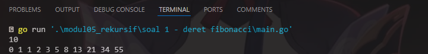
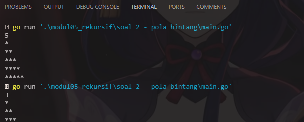
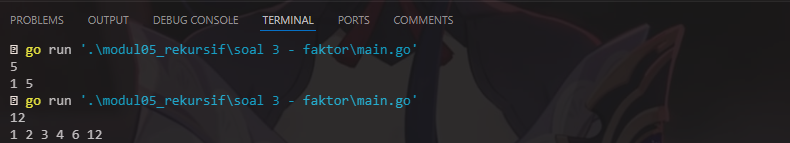
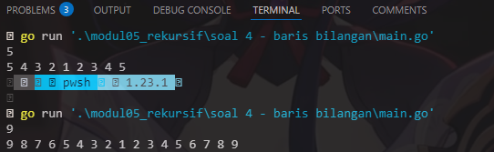
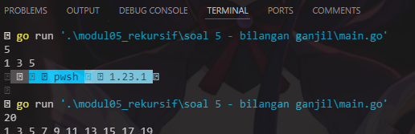
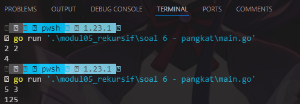

# <h1 align="center">Laporan Praktikum Modul 05 <br> Rekrusif</h1>
<p align="center">Wahyu Widodo - 103112430011</p>

## Dasar Teori

Rekursi adalah teknik dalam pemrograman di mana sebuah fungsi memanggil dirinya sendiri secara langsung atau tidak langsung untuk menyelesaikan suatu masalah yang lebih kecil dari masalah aslinya.

## Unguided

### Soal 1

Deret fibonacci adalah sebuah deret dengan nilai suku ke-0 dan ke-1 adalah 0 dan 1, dan nilai suku ke-n selanjutnya adalah hasil penjumlahan dua suku sebelumnya. Secara umum dapat diformulasikan �( = �(+. + �(+# . Berikut ini adalah contoh nilai deret fibonacci hingga suku ke-10. Buatlah program yang mengimplementasikan fungsi rekursif pada deret fibonacci tersebut

```go
package main

import "fmt"

func fibonacci(n int) int {
	if n == 0 {
		return 0
	} else if n == 1 {
		return 1
	}
	return fibonacci(n-1) + fibonacci(n-2)
}

func main() {
	var n int
	fmt.Scan(&n)

	for i := 0; i <= n; i++ {
		fmt.Print(fibonacci(i), " ")
	}
	fmt.Println()
}

```

> Output <br>
> 

Program ini melakukan rekrusif di dalam fungsi fibonacci terdapat percabangan jika n = 0 maka kembalikan 0 dan jika n = 1 maka kembalikan nilai 1. Lalu didalam fungsi rekrusif memanggil fungsi diri nya sendiri yang akan dikembalikan nilai nya dengan masukkan nilai n - 1 + n-2 untuk menampilkan deret fibonacci. Lalu didalam main program terdapat for loop untuk mendapatkan semua bilangan sampai dng n yang dimana nanti akan diubah menjadi deret fibonacci dengan cara memanggil fungsi rekrusif di dalam for loop. Kemudian di for loop langsung print hasil dari nilai yang dikembalikan oleh fungsi rekrusif fibonacci.
<br>
### Soal 2

Buatlah sebuah program yang digunakan untuk menampilkan pola bintang berikut ini dengan menggunakan fungsi rekursif. N adalah masukan dari user

```go
package main

import "fmt"

func bintang(n int) {
	if n == 0 {
		return
	}
	fmt.Print("*")
	bintang(n - 1)
}

func pola(n, baris int) {
	if baris > n {
		return
	}
	bintang(baris)
	fmt.Println()
	pola(n, baris+1)
}

func main() {
	var n int
	fmt.Scan(&n)
	pola(n, 1)
}

```

> Output <br>
> 

Program ini untuk menampilkan pola bintang sesuai input oleh pengguna. terdapat 2 fungsi yang pertama fungsi bintang untuk menampilkan . Lalu fungsi yang kedua adalah Pola yang digunakan untuk menggambar pola bintang nya yg dimana memanggil fungsi bintang dan memangil fungsi diri nya sendiri. Lalu masuk ke main program terdapat variable n dengan tipe data integer dan terdapat scan untuk menerima input n yang akan di inputkan pengguna untuk mencetak pola bintang,
<br>
### Soal 3

Buatlah program yang mengimplementasikan rekursif untuk menampilkan faktor bilangan dari suatu N, atau bilangan yang apa saja yang habis membagi N

```go
package main

import "fmt"

func cetakFaktor(n, pembagi int) {
	if pembagi > n {
		return
	}
	if n%pembagi == 0 {
		fmt.Print(pembagi, " ")
	}
	cetakFaktor(n, pembagi+1)
}

func main() {
	var n int
	fmt.Scan(&n)
	cetakFaktor(n, 1)
	fmt.Println()
}

```

> Output <br>
> 

Program ini menampilkan barisan bilangan yang menjadi faktor dari N terurut dari 1 hingga N. Disini terdapat fungsi rekrusif cetakFaktor yang isi nya adalah terdapat base case jika pembagi lebih dari n lalu jika n%pembagi = 0 maka tampilkan faktor nya. Lalu dibaris terakhir terdapat pemanggilan diri nya sendiri dengan parameter n dan pembagi + 1. Selanjutnya masuk ke main program seperti biasa scan bilangan n untuk menentukan kapan berhenti mencetak barisan bilangan faktor lalu panggil fungsi rekursif cetakFaktor dimain program agar fungsi bisa berjalan.

### Soal 4

Buatlah program yang mengimplementasikan rekursif untuk menampilkan barisan bilangan tertentu

```go
package main

import "fmt"

func cetakDescending(n, i int) {
	if i == 0 {
		return
	}
	fmt.Print(i, " ")
	cetakDescending(n, i-1)
}

func cetakAscending(n, i int) {
	if i > n {
		return
	}
	fmt.Print(i, " ")
	cetakAscending(n, i+1)
}

func cetakUrutan(n int) {
	cetakDescending(n, n)
	cetakAscending(n, 2)
	fmt.Println()
}

func main() {
	var n int
	fmt.Scan(&n)
	cetakUrutan(n)
}

```

> Output <br>
> 

Program ini menampilkan barisan bilangan descending lalu dilanjutkan dengan ascending. Terdapat 3 prosedur yang pertama ada prosedur cetakDescending terdapat parameter n, i tipe data nya integer lalu isi nya jika i == 0 maka program berhenti jika != 0 maka prosedur melakukan print i dan memanggil diri sendiri dengan parameter n, i-1. Lanjut ke prosedur kedua ada cetakAscending sama seperti sebelum nya cuma pas pemanggilan diri sendiri parameter nya jadi + (n,i+1). Lalu di prosedur terakhir ada cetakUrutan yang digunakan untuk memanggil 2 prosedur sebelum nya yaitu cetakDescending dan cetakAscending yang nanti nya print nya bareng. Lanjut ke main program deklarasi kan  variable n tipe nya integer lalu scan n kemudian cukup panggil prosedur rekursif cetakUrutan saja karena di cetakUrutan sudah memanggil semua prosedur ascending dan descending yang dimana sudah langsung print hasil daripada ascending dan descending nya jadi ngga perlu print lagi dimain program.

### Soal 5

Buatlah program yang mengimplementasikan rekursif untuk menampilkan barisan bilangan ganjil.

```go
package main

import "fmt"

func cetakGanjil(n, i int) {
	if i > n {
		return
	}
	fmt.Print(i, " ")
	cetakGanjil(n, i+2) 
}

func main() {
	var n int
	fmt.Scan(&n)
	cetakGanjil(n, 1)
	fmt.Println()
}

```

> Output <br>
> 

Program ini menampilkan barisan bilangan ganjil. Disini terdapat prosedur rekursif dengan nama cetakGanjil lalu memiliki parameter n, i dengan tipe data integer. Lalu isi nya jika i > n maka program berhenti namun jika i < n panggil fungsi diri sendiri dengan assign parameter nya n, i+2 agar bilangan yang didapat ganjil. Oh iya sebelum memanggil diri sendiri i nya di outputin/ diprint agar muncul bilangan ganjil nya. Di main program cukup membuat variable n tipe nya integer lalu scan n habis itu panggil prosedur rekursif nya dengan memasukan n,1 dan tidak perlu print lagi karena sudah langsung di print di prosedur cetakGanjil

### Soal 6

Buatlah program yang mengimplementasikan rekursif untuk menampilkan barisan bilangan ganjil.

```go
package main

import "fmt"

func pangkat(x, y int) int {
	if y == 0 {
		return 1
	}
	return x * pangkat(x, y-1)
}

func main() {
	var x, y int
	fmt.Scan(&x, &y)

	fmt.Println(pangkat(x, y))
}


```

> Output <br>
> 

Program ini untuk mencari hasil pangkat dua buah bilangan bulat. Disini terdapat fungsi rekursif pangkat yang dimana terdapat parameter x dan y bertipe data integer dan mengembalikan sbg integer. Lalu isi nya terdapat jika nilai y udah sampai 0 maka kembalikan 1 dan kalo belum 0 maka lakukan pemanggilan fungsi diri sendiri dengan x * pangkat(x,y-1). Lalu ke main program terdapat variable x dan y tipe data nya integer lalu scan x dan y nya lalu menampilkan langsung hasil return fungsi rekursif pangkat.