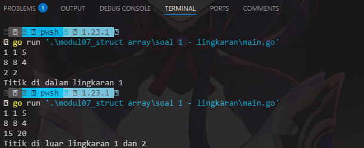
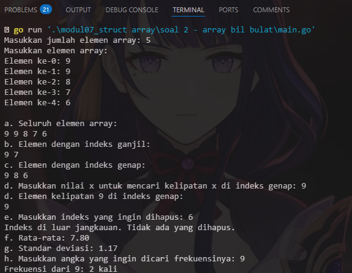
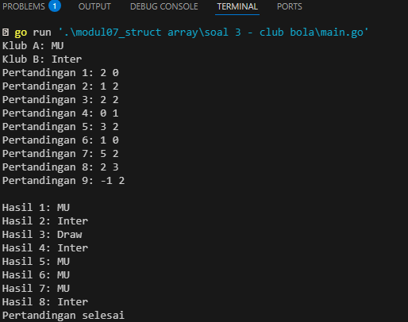
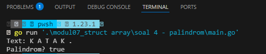

# <h1 align="center">Laporan Praktikum Modul 07 <br> Struct & Array </h1>
<p align="center">Wahyu Widodo - 103112430011</p>

## Dasar Teori

Struct adalah
Array adalah

## Unguided

### Soal 1

Suatu lingkaran didefinisikan dengan koordinat titik pusat (𝑐𝑥, 𝑐𝑦) dengan radius 𝑟. Apabila 
diberikan dua buah lingkaran, maka tentukan posisi sebuah titik sembarang (𝑥, 𝑦) berdasarkan dua lingkaran tersebut. Gunakan tipe bentukan titik untuk menyimpan koordinat, dan tipe bentukan lingkaran untuk menyimpan titik pusat lingkaran dan radiusnya

```go
package main

import (
	"fmt"
	"math"
)

type Titik struct {
	x, y float64
}

type Lingkaran struct {
	titikPusat Titik
	radius     float64
}

func jarak(p, q Titik) float64 {
	return math.Sqrt(math.Pow(p.x-q.x, 2) + math.Pow(p.y-q.y, 2))
}

func didalam(c Lingkaran, p Titik) bool {
	return jarak(c.titikPusat, p) <= c.radius
}

func main() {
	var cx1, cy1, r1 float64
	var cx2, cy2, r2 float64
	var x, y float64

	fmt.Scanln(&cx1, &cy1, &r1)
	lingkaran1 := Lingkaran{titikPusat: Titik{x: cx1, y: cy1}, radius: r1}

	fmt.Scanln(&cx2, &cy2, &r2)
	lingkaran2 := Lingkaran{titikPusat: Titik{x: cx2, y: cy2}, radius: r2}

	fmt.Scanln(&x, &y)

	dalam1 := didalam(lingkaran1, Titik{x: x, y: y})
	dalam2 := didalam(lingkaran2, Titik{x: x, y: y})

	if dalam1 && dalam2 {
		fmt.Println("Titik di dalam lingkaran 1 dan 2")
	} else if dalam1 {
		fmt.Println("Titik di dalam lingkaran 1")
	} else if dalam2 {
		fmt.Println("Titik di dalam lingkaran 2")
	} else {
		fmt.Println("Titik di luar lingkaran 1 dan 2")
	}
}
```

> Output <br>
> 

Program ini melakukan perhitungan mencari titik lingkaran. Terdapat 2 tipe data bentukan yaitu titik dan lingkaran, lalu terdapat 2 fungsi yaitu untuk mencari jarak dan menentukan titik didalam. Selanjutnya di parameter fungsi jarak terdapat p,q dng tipe data bentukan Titik, lalu mengembalikan nilai tipe data float. Lanjut ke fungsi didalam terdapat 2 parameter yaitu c dng tipe data bentukan dari Lingkaran dan p dari tipe data bentukan Titik. Lanjut ke main program, seperti biasa bkin variable cx1, cy1, r1, cx2, cy2, r2 tipe datanya float lalu untuk variable koordinat ada x, y dengan tipe data float juga. lanjut ke scan utnuk nerima input user diikutin dg memanggil tipe bentukan lingkaran yg terdapat  objek titik pusat dan radius. lalu scan kedua koordinat x dan y, terus terdapat variable dalam1 dan dalam 2 yg dimana memanggil fungsi didalam dg assisn parameter menggunakan tipe data bentukan titik. Lalu tedapat perbandingan jika didalam1 dan didalam2 true maka tampilkan titik didalam lingkaran 1 dan 2. jika cuma dalam1 yg true maka tampilkan hanya titik didalam lingkaran 1 begitujuga yg dalam2 lalu jika tidak terpenuhi semua atau false semua maka tampilkan titik diluar lingkaran 1 dan 2
<br>
### Soal 2

Sebuah array digunakan untuk menampung sekumpulan bilangan bulat. Buatlah program
yang digunakan untuk mengisi array tersebut sebanyak N elemen nilai. Asumsikan array 
memiliki kapasitas penyimpanan data sejumlah elemen tertentu. Program dapat menampilkan beberapa informasi berikut:

a. Menampilkan keseluruhan isi dari array.
b. Menampilkan elemen-elemen array dengan indeks ganjil saja.
c. Menampilkan elemen-elemen array dengan indeks genap saja (asumsi indek ke-0 adalah
genap).
d. Menampilkan elemen-elemen array dengan indeks kelipatan bilangan x. x bisa diperoleh
dari masukan pengguna.
e. Menghapus elemen array pada indeks tertentu, asumsi indeks yang hapus selalu valid.
Tampilkan keseluruhan isi dari arraynya, pastikan data yang dihapus tidak tampil
f. Menampilkan rata-rata dari bilangan yang ada di dalam array.
g. Menampilkan standar deviasi atau simpangan baku dari bilangan yang ada di dalam array
tersebut.
h. Menampilkan frekuensi dari suatu bilangan tertentu di dalam array yang telah diisi
tersebut.

```go
package main

import (
	"fmt"
	"math"
)

func inputArray(n int) []int {
	arr := make([]int, n)
	fmt.Println("Masukkan elemen array:")
	for i := 0; i < n; i++ {
		fmt.Printf("Elemen ke-%d: ", i)
		fmt.Scanln(&arr[i])
	}
	return arr
}

func tampilArray(arr []int) {
	fmt.Println("\na. Seluruh elemen array:")
	for i := 0; i < len(arr); i++ {
		fmt.Printf("%d ", arr[i])
	}
	fmt.Println()
}

func tampilIndeksGanjil(arr []int) {
	fmt.Println("b. Elemen dengan indeks ganjil:")
	for i := 1; i < len(arr); i += 2 {
		fmt.Printf("%d ", arr[i])
	}
	fmt.Println()
}

func tampilIndeksGenap(arr []int) {
	fmt.Println("c. Elemen dengan indeks genap:")
	for i := 0; i < len(arr); i += 2 {
		fmt.Printf("%d ", arr[i])
	}
	fmt.Println()
}

func tampilKelipatanXGenap(arr []int, x int) {
	fmt.Printf("d. Elemen kelipatan %d di indeks genap:\n", x)
	for i := 0; i < len(arr); i += 2 {
		if arr[i]%x == 0 {
			fmt.Printf("%d ", arr[i])
		}
	}
	fmt.Println()
}

func hapusIndeks(arr []int, index int) []int {
	if index >= 0 && index < len(arr) {
		arr = append(arr[:index], arr[index+1:]...)
		fmt.Println("e. Array setelah penghapusan:")
		for i := 0; i < len(arr); i++ {
			fmt.Printf("%d ", arr[i])
		}
		fmt.Println()
	} else {
		fmt.Println("Indeks di luar jangkauan. Tidak ada yang dihapus.")
	}
	return arr
}

func rataRata(arr []int) float64 {
	jumlah := 0
	for i := 0; i < len(arr); i++ {
		jumlah += arr[i]
	}
	return float64(jumlah) / float64(len(arr))
}

func standarDeviasi(arr []int, rata float64) float64 {
	total := 0.0
	for i := 0; i < len(arr); i++ {
		total += math.Pow(float64(arr[i])-rata, 2)
	}
	return math.Sqrt(total / float64(len(arr)))
}

func frekuensi(arr []int, angka int) int {
	jumlah := 0
	for i := 0; i < len(arr); i++ {
		if arr[i] == angka {
			jumlah++
		}
	}
	return jumlah
}

func main() {
	var n int
	fmt.Print("Masukkan jumlah elemen array: ")
	fmt.Scanln(&n)

	arr := inputArray(n)

	tampilArray(arr)
	tampilIndeksGanjil(arr)
	tampilIndeksGenap(arr)

	var x int
	fmt.Print("d. Masukkan nilai x untuk mencari kelipatan x di indeks genap: ")
	fmt.Scanln(&x)
	tampilKelipatanXGenap(arr, x)

	var indexHapus int
	fmt.Print("e. Masukkan indeks yang ingin dihapus: ")
	fmt.Scanln(&indexHapus)
	arr = hapusIndeks(arr, indexHapus)

	rata := rataRata(arr)
	fmt.Printf("f. Rata-rata: %.2f\n", rata)

	stdDev := standarDeviasi(arr, rata)
	fmt.Printf("g. Standar deviasi: %.2f\n", stdDev)

	var angkaCari int
	fmt.Print("h. Masukkan angka yang ingin dicari frekuensinya: ")
	fmt.Scanln(&angkaCari)
	freq := frekuensi(arr, angkaCari)
	fmt.Printf("Frekuensi dari %d: %d kali\n", angkaCari, freq)
}


```

> Output <br>
> 

Langsung aja ke penjelasan fungsi pertam ada inputArray untuk embuat array dengan panjang untuk user menginput satu per satu elemen array. Fungsi selanjutnya tampilArray untuk menampilkan semua elemen array menggunakan for loop. Fungsi selanjut nya tampilIndeksGanjil untuk menampilkan elemen array yang berada di indeks ganjil. Lanjut fungsi tampilIndeksGenap untuk menampilkan elemen array yang berada di indeks genap. Selanjutnya fungsi tampilKelipatanXGenap untuk menampilkan elemen yang merupakan kelipatan X dan berada di indeks genap. Lalu ada fungsi hapusIndeks untuk menghapus elemen array pada indeks tertentu menggunakan slicing dan appent tetapi dicek dulu nih apakah indeks valid dulu (index >= 0 && index < len(arr)). Lanjut ke fungsi rataRata untuk menghitung rata-rata seluruh elemen array. Selanjutnya ada fungsi standarDeviasi untuk Menghitung standar deviasi populasi. Dan fungsi yg terakhir adalah frekuensi untuk menghitung berapa kali angka muncul dalam array. Masuk ke main program meminta user jumlah elemen array yg ingin dimasukkan. Lalu memanggil semua fungsi sesuai urutan soal dan ditampilkan.
<br>
### Soal 3

Sebuah program digunakan untuk menyimpan dan menampilkan nama-nama klub yang 
memenangkan pertandingan bola pada suatu grup pertandingan. Buatlah program yang 
digunakan untuk merekap skor pertandingan bola 2 buah klub bola yang berlaga.
Pertama-tama program meminta masukan nama-nama klub yang bertanding, kemudian 
program meminta masukan skor hasil pertandingan kedua klub tersebut. Yang disimpan 
dalam array adalah nama-nama klub yang menang saja.  Proses input skor berhenti ketika skor salah satu atau kedua klub tidak valid (negatif). Di akhir program, tampilkan daftar klub yang memenangkan pertandingan.

```go
package main

import "fmt"

type Klub struct {
	Nama string
}

type Pertandingan struct {
	Skor1    int
	Skor2    int
	Pemenang string
}

func main() {
	var klub1, klub2 Klub
	var pertandingan []Pertandingan
	urutan := 1

	fmt.Print("Klub A: ")
	fmt.Scan(&klub1.Nama)

	fmt.Print("Klub B: ")
	fmt.Scan(&klub2.Nama)

	for {
		var skor1, skor2 int
		fmt.Printf("Pertandingan %d: ", urutan)
		fmt.Scan(&skor1, &skor2)

		if skor1 < 0 || skor2 < 0 {
			break
		}

		hasil := ""
		if skor1 > skor2 {
			hasil = klub1.Nama
		} else if skor2 > skor1 {
			hasil = klub2.Nama
		} else {
			hasil = "Draw"
		}

		pertandingan = append(pertandingan, Pertandingan{
			Skor1:    skor1,
			Skor2:    skor2,
			Pemenang: hasil,
		})

		urutan++
	}

	fmt.Println()
	for i, p := range pertandingan {
		fmt.Printf("Hasil %d: %s\n", i+1, p.Pemenang)
	}
	fmt.Print("Pertandingan selesai")
}

```

> Output <br>
> 

Program ini untuk mencatat hasil beberapa pertandingan antara dua klub sepak bola. User akan menginput nama dua klub dan kemudian mengisi skor pertandingan satu per satu. Program akan menentukan pemenang dari masing-masing pertandingan dan menampilkannya setelah input selesai. terdapat struct Klub untuk menyimpan klub 1 dan 2 dan Pertandingan untuk skor klub 1 dan 2 lalu ada Pemenang juga. Masuk ke main program meminta user menginput nama dua klub. Lalu user menginput skor untuk pertandingan ke-urutan. Jika ada skor negatif, input berhenti. Setelah itu ada percabangan untuk menentukan siapa pemenangnya berdasarkan skor, jika sama, maka hasilnya "Draw". Hasil pertandingan ditambahkan ke slice pertandingan. Urutan pertandingan ditambahkan untuk input selanjutnya. Yang terakhir program akan menampilkan hasil pertandingan satu per satu dengan nama pemenang atau "Draw".

### Soal 4

Sebuah array digunakan untuk menampung sekumpulan karakter, Anda diminta untuk 
membuat sebuah subprogram untuk melakukan membalikkan urutan isi array dan memeriksa 
apakah membentuk palindrom.

```go
package main

import "fmt"

const NMAX int = 127

type tabel [NMAX]rune

func isiArray(t *tabel, n *int) {
	var ch rune
	fmt.Print("Text: ")
	*n = 0

	for {
		fmt.Scanf("%c", &ch)
		if ch == ' ' {
			continue
		}

		if ch == '.' || *n >= NMAX {
			break
		}

		(*t)[*n] = ch
		*n++
	}
}

func cekPalindrom(t tabel, n int) bool {
	for i := 0; i < n/2; i++ {
		if t[i] != t[n-1-i] {
			return false
		}
	}
	return true
}

func main() {
	var tab tabel
	var m int
	var palindrom bool
	isiArray(&tab, &m)
	if cekPalindrom(tab, m) {
		palindrom = true
	} else {
		palindrom = false
	}

	fmt.Print("Palindrom? ", palindrom)
}


```

> Output <br>
> 

Program ini untuk mengecek apakah input yang diberikan oleh pengguna adalah palindrom atau bukan. Fungsi isiArray  digunakan untuk mengisi array t dengan karakter satu per satu dari input user. fmt.Scanf("%c", &ch) membaca satu karakter per iterasi. Jika karakter adalah spasi (' '), maka diabaikan (continue). Jika karakter adalah titik (.), maka input berhenti. Karakter lainnya akan dimasukkan ke dalam array dan n akan bertambah. Array t berisi karakter non-spasi dan tidak mengikutsertakan titik di akhir kalimat.  Fungsi cekPalindrom digunakan untuk mengecek apakah array t adalah palindrom, dengan membandingkan elemen dari depan dan belakang hingga ke tengah. Jika ada satu saja yang tidak sama, maka return false, sama semua cocok, return true. Masuk ke main program, memanggil isiArray untuk mengisi data karakter dari input user. Lalu memanggil cekPalindrom untuk memeriksa apakah data tersebut palindrom. Lalu menampilkan hasilnya.


 
