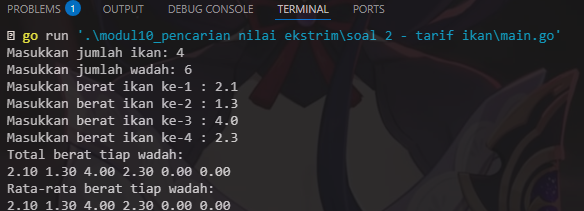

# <h1 align="center">Laporan Praktikum Modul 10 <br> Pencarian nilai ekstrim pada himpunan data </h1>
<p align="center">Wahyu Widodo - 103112430011</p>

## Dasar Teori

Pencarian nilai ekstrim pada himpunan data merupakan proses untuk menemukan nilai maksimum dan minimum dari sekumpulan data, seperti array atau list. Proses ini dilakukan dengan membandingkan setiap elemen dalam data satu per satu untuk menentukan elemen terbesar (maksimum) dan terkecil (minimum).


## Unguided

### Soal 1

Sebuah program digunakan untuk mendata berat anak kelinci yang akan dijual ke pasar. Program ini menggunakan array dengan kapasitas 1000 untuk menampung data berat anak kelinci yang akan dijual

```go
package main

import "fmt"

func main() {
	var n int
	fmt.Print("Masukkan jumlah anak kelinci: ")
	fmt.Scan(&n)

	if n <= 0 || n > 1000 {
		fmt.Println("Jumlah anak kelinci harus antara 1 sampai 1000")
		return
	}

	berat := make([]float64, n)

	fmt.Printf("Masukkan berat %d anak kelinci:\n", n)
	for i := 0; i < n; i++ {
		fmt.Scan(&berat[i])
	}

	min := berat[0]
	max := berat[0]

	for i := 1; i < n; i++ {
		if berat[i] < min {
			min = berat[i]
		}
		if berat[i] > max {
			max = berat[i]
		}
	}

	fmt.Printf("Berat terkecil: %.2f\n", min)
	fmt.Printf("Berat terbesar: %.2f\n", max)
}

```

> Output <br>
> 

Program ini mencari berat terkecil dan terbesar anak kelinci. Input user pertama adalah berapa jumlah kelinci yang mau di data, lalu user memasukan masing masing beratnya. Kemudian program menampilkan berat terkecil dan terberat nya. Program membuat array berat untuk menyimpan inputan berat si anak kelinci nya. Lalu terdapat perulangan untuk mencari nilai min dan max berat anak kelinci nya dan dimasukkan ke variable min dan max untuk ditampilkan ke user.
<br>
### Soal 2

Sebuah program digunakan untuk menentukan tarif ikan yang akan dijual ke pasar. Program ini 
menggunakan array dengan kapasitas 1000 untuk menampung data berat ikan yang akan 
dijual

```go
package main

import "fmt"

func main() {
	var x, y int
	fmt.Print("Masukkan jumlah ikan dan jumlah wadah (x y): ")
	fmt.Scan(&x, &y)

	if x <= 0 || x > 1000 || y <= 0 || y > 1000 {
		fmt.Println("x dan y harus antara 1 sampai 1000")
		return
	}

	ikan := make([]float64, x)
	fmt.Println("Masukkan berat ikan:")
	for i := 0; i < x; i++ {
		fmt.Scan(&ikan[i])
	}

	totalBerat := make([]float64, y)
	jumlahIkan := make([]int, y)

	for i := 0; i < x; i++ {
		indexWadah := i % y
		totalBerat[indexWadah] += ikan[i]
		jumlahIkan[indexWadah]++
	}

	fmt.Println("Total berat tiap wadah:")
	for i := 0; i < y; i++ {
		fmt.Printf("%.2f ", totalBerat[i])
	}
	fmt.Println()

	fmt.Println("Rata-rata berat tiap wadah:")
	for i := 0; i < y; i++ {
		if jumlahIkan[i] > 0 {
			fmt.Printf("%.2f ", totalBerat[i]/float64(jumlahIkan[i]))
		} else {
			fmt.Printf("0.00 ")
		}
	}
	fmt.Println()
}

```

> Output <br>
> 

Program ini menghitung total berat tiap wadah dan rata rata berat tiap wadah ikan. User diminta untuk memasukkan jumlah ikan lalu jumlah wadah, kemudian memasukkan masing masing berat ikan nya. Kemudian program melakukan perhitungan dan menampilkan nya. Lalu disini membuat beberapa array yg pertama ada array ikan untuk menyimpan berat ikan yg dimasukkan user, lalu ada array total berat yg dimana untuk menyimpan berat total, lalu ada array jumlah ikan untuk menyimpan berapa jumlah ikan yg dimasukkan user. lalu disini ada perulangan untuk menghitung total semua berat tiap wadah dan rata rata berat tiap wadah yg kemudian langsung ditampilkan.
<br>
### Soal 3

Pos Pelayanan Terpadu (posyandu) sebagai tempat pelayanan kesehatan perlu mencatat data berat balita (dalam kg). Petugas akan memasukkan data tersebut ke dalam array. Dari data yang diperoleh akan dicari berat balita terkecil, terbesar, dan reratanya.

```go
package main

import "fmt"

const maxBalita = 100

type arrBalita [maxBalita]float64

func hitungMinMax(arr arrBalita, n int, bMin *float64, bMax *float64) {
	*bMin = arr[0]
	*bMax = arr[0]
	for i := 1; i < n; i++ {
		if arr[i] < *bMin {
			*bMin = arr[i]
		}
		if arr[i] > *bMax {
			*bMax = arr[i]
		}
	}
}

func rerata(arr arrBalita, n int) float64 {
	var total float64 = 0
	for i := 0; i < n; i++ {
		total += arr[i]
	}
	return total / float64(n)
}

func main() {
	var n int
	var berat arrBalita
	var min, max float64
	
	fmt.Print("Masukan banyak data berat balita : ")
	fmt.Scan(&n)

	for i := 0; i < n; i++ {
		fmt.Printf("Masukan berat balita ke-%d: ", i+1)
		fmt.Scan(&berat[i])
	}
	
	hitungMinMax(berat, n, &min, &max)

	fmt.Printf("Berat balita minimum: %.2f kg\n", min)
	fmt.Printf("Berat balita maksimum: %.2f kg\n", max)

	rata := rerata(berat, n)
	fmt.Printf("Rerata berat balita: %.2f kg\n", rata)
}
```

> Output <br>
> 

Program ini untuk menghitung berat balita minimum, masksimum, dan rerata berat balita. Program menentukan jumlah array maks balita yaitu 100, lalu terdapat 1 fungsi dan 1 prosedur.  Didalam prosedur hitungMinMax terdapat perulangan untuk menentukan nilai min dan max nya kemudian yang fungsi rerata terdapat perulangan juga untuk menghitung nilai rata rata nya. Masuk ke main progam. user diminta memasukkan banyak data berat balita. lalu user diminta untuk memasukkan masing masing berat balita nya menggunakan perulangan sejumlah berapa banyak data berat balita yg sudah dinputkan sebelumnya. Lalu pangil prosedur hitungMinMax nya kemudian ditampilkan lalu ada juga panggil fungsi rata rata kemudian tampilkan nilai rata rata nya
