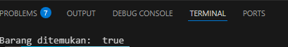
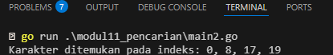
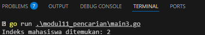
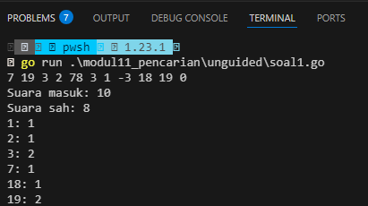
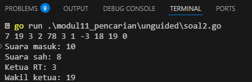
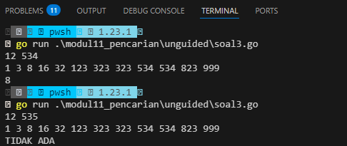

# <h1 align="center">Laporan Praktikum Modul 11  PENCARIAN NILAI ACAK PADA HIMPUNAN DATA </h1>
<p align="center">Wahyu Widodo - 103112430011</p>

## Dasar Teori

Pencarian (searching) adalah proses menemukan data tertentu (nilai acak) dalam sebuah himpunan data (array, list, atau struktur data lainnya). 
- Sequential Search
   adalah metode pencarian di mana setiap elemen dalam himpunan data diperiksa satu per satu hingga ditemukan elemen yang dicari atau sampai seluruh elemen diperiksa.
- Binary search
  adalah metode pencarian yang **jauh lebih cepat** dibandingkan sequential search, tapi **himpunan data harus sudah terurut** terlebih dahulu.

<br>
## Guided
### Soal 1
Sebuah toko memiliki daftar nama barang sebanyak n buah. Setiap nama barang disimpan dalam array bertipe string.Buatlah program untuk mencari apakah nama barang yang dicari (x) tersedia ditoko atau tidak. Pencarian dilakukan menggunakan algoritma sequanbtial search. Program mengembalikan true jika barang ditemukan, atau false jikat tidak ditemukan

```go
package main

import "fmt"

type arrdata []string

func main() {
	var T arrdata
	T = append(T, "sabun", "sampo", "odol", "tisu", "minyak")
	var found = false
	var n = len(T)
	var x = "odol"

	found = seq(T, n, x)

	if found {
		fmt.Println("Barang ditemukan: ", found)
	} else {
		fmt.Println("Barang tidak ditemukan")
	}

}

func seq(T arrdata, n int, x string) bool {
	var found = false
	var i = 0
	for i < n && !found {
		found = T[i] == x
		i = i + 1
	}
	return found
}
```

> Output <br>
> 

Program ini melakukan pencarian data menggunakan sequential search yg dimana jika didalam fungsi seq terdapat kesamaan pada array dan x yg ingin dicari maka found true.

<br>
### Soal 2
buat program untuk membaca sebuah kalimat (string) dan sebuah karakter yang ingin dicari
gunakan sequantial search untuk mencari apakah karakter tersebut terdapat di dalam kalimat. jika ya  tampilakn semua posisi indeks katerakter tersebut di kalimat

input
kalimat = "algoritma pemograman"
karakter = "a"

output
ada pada : 0,10,18


```go
package main

import "fmt"

func seqSearch(kalimat string, karakter byte) []int {
	var posisi []int
	for i := 0; i < len(kalimat); i++ {
		if kalimat[i] == karakter {
			posisi = append(posisi, i)
		}
	}
	return posisi
}

func main() {
	var kalimat string
	var karakter rune

	kalimat = "algoritma pemrograman"
	karakter = 'a'
	posisi := seqSearch(kalimat, byte(karakter))

	if len(posisi) > 0 {
		fmt.Print("Karakter ditemukan pada indeks: ")
		for i := 0; i < len(posisi); i++ {
			fmt.Print(posisi[i])
			if i != len(posisi)-1 {
				fmt.Print(", ")
			}
		}
	} else {
		fmt.Println("Karakter tidak ditemukan.")
	}
}

```

> Output <br>
> 

Program ini melakukan pencarian data menggunakan sequential search yg dimana jika didalam fungsi seq terdapat kesamaan pada array kalimat dengan karakter yg dicari, maka dapatkan posisi indeks array nya .

<br>
### Soal 3
diketahui array mahasiswa terdiri atas n data bertipa struct yang menyimpan data nama dan nim mahasiswa. Array sudah terurut membesar berdasarkan nim. buatlah program untuk mencari nim tertentu menggunakan algoritma binary search dan mengembalikan indeks dari nim tersebut

input
n = 4
mahasiswa = [{}]
x =

output 
indeks mahasiswa dii termukan ......


```go
package main

import "fmt"

type Mahasiswa struct {
	nama string
	nim  string
}

type ArrMhs []Mahasiswa

func binarySearch(arr ArrMhs, n int, nim string) int {
	var found int = -1
	var med int
	var kr int = 0
	var kn int = n - 1

	for kr <= kn && found == -1 {
		med = (kr + kn) / 2
		if nim < arr[med].nim {
			kn = med - 1
		} else if nim > arr[med].nim {
			kr = med + 1
		} else {
			found = med
		}
	}

	return found
}

func main() {
	var arrMhs ArrMhs
	var x string
	var n int
	arrMhs = append(arrMhs, Mahasiswa{"Andi", "220001"})
	arrMhs = append(arrMhs, Mahasiswa{"Budi", "220002"})
	arrMhs = append(arrMhs, Mahasiswa{"Citra", "220003"})
	arrMhs = append(arrMhs, Mahasiswa{"Dina", "220004"})

	n = 4
	x = "220003"
	hasil := binarySearch(arrMhs, n, x)

	if hasil == -1 {
		fmt.Println("NIM tidak ditemukan.")
	} else {
		fmt.Printf("Indeks mahasiswa ditemukan: %d", hasil)
	}
}


```

> Output <br>
> 

Program ini melakukan pencarian data nim pada sebuah struct mahasiswa menggunakan binary search. Didalam fungsi binary terdapat variable found, kr, kn, med yg dimana digunakan untuk binary search pertama med / 2 lalu dia akan ke kr atau kn berdasarkan grater than. Nah jika sudah found maka tampilkan indeks nya

<br>

## Unguided

### Soal 1

Pada pemilihan ketua RT yang baru saja berlangsung, terdapat 20 calon ketua yang bertanding 
memperebutkan suara warga. Perhitungan suara dapat segera dilakukan karena warga cukup 
mengisi formulir dengan nomor dari calon ketua RT yang dipilihnya. Seperti biasa, selalu ada 
pengisian yang tidak tepat atau dengan nomor pilihan di luar yang tersedia, sehingga data juga 
harus divalidasi. Tugas Anda untuk membuat program mencari siapa yang memenangkan 
pemilihan ketua RT.
Buatlah program pilkart yang akan membaca, memvalidasi, dan menghitung suara yang 
diberikan dalam pemilihan ketua RT tersebut

```go
package main

import "fmt"

func main() {
	var suaraMasuk []int
	var input int

	for {
		fmt.Scan(&input)
		if input == 0 {
			break
		}
		suaraMasuk = append(suaraMasuk, input)
	}

	suaraValid := make(map[int]int)
	totalSuara := len(suaraMasuk)
	jumlahSuaraSah := 0

	for _, suara := range suaraMasuk {
		if suara >= 1 && suara <= 20 {
			suaraValid[suara]++
			jumlahSuaraSah++
		}
	}

	fmt.Printf("Suara masuk: %d\n", totalSuara)
	fmt.Printf("Suara sah: %d\n", jumlahSuaraSah)
	for i := 1; i <= 20; i++ {
		if count, ada := suaraValid[i]; ada {
			fmt.Printf("%d: %d\n", i, count)
		}
	}
}

```

> Output <br>
> 

Program ini digunakan untuk menghitungkan suara masuk dan sah. Program meminta user input suara lalu disimpan divariable totalSuara. Lalu terdapat perulangan jika suara yg diinput user diatas 1 dan kurang dari 20 maka jumlahSuara +1 dan menambahkan ke array. Lalu tampilkan ke user.
<br>
### Soal 2

Berdasarkan program sebelumnya, buat program pilkart yang mencari siapa pemenang 
pemilihan ketua RT. Sekaligus juga ditentukan bahwa wakil ketua RT adalah calon yang 
mendapatkan suara terbanyak kedua. Jika beberapa calon mendapatkan suara terbanyak yang sama, ketua terpilih adalah dengan nomor peserta yang paling kecil dan wakilnya dengan nomor 
peserta terkecil berikutnya. Masukan hanya satu baris data saja, berisi bilangan bulat valid yang kadang tersisipi dengan 
data tidak valid. Data valid adalah bilangan bulat dengan nilai di antara 1 s.d. 20 (inklusif). Data 
berakhir jika ditemukan sebuah bilangan dengan nilai 0.
Keluaran dimulai dengan baris berisi jumlah data suara yang terbaca, diikuti baris yang berisi 
berapa banyak suara yang valid. Kemudian tercetak calon nomor berapa saja yang menjadi 
pasangan ketua RT dan wakil ketua RT yang baru.
No Masukan Keluaran
1 7 19 3 2 78 3 1 -3 18 19 0 Suara masuk: 10
Suara sah: 8
Ketua RT: 3
Wakil ketua: 19

```go
package main

import "fmt"

func main() {
	var suaraMasuk []int
	var input int

	for {
		fmt.Scan(&input)
		if input == 0 {
			break
		}
		suaraMasuk = append(suaraMasuk, input)
	}

	totalSuara := len(suaraMasuk)
	suaraValid := hitungSuaraValid(suaraMasuk)
	jumlahSuaraSah := totalSuaraSah(suaraValid)
	ketua, wakil := cariKetuaWakil(suaraValid)

	fmt.Printf("Suara masuk: %d\n", totalSuara)
	fmt.Printf("Suara sah: %d\n", jumlahSuaraSah)
	fmt.Printf("Ketua RT: %d\n", ketua)
	fmt.Printf("Wakil ketua: %d\n", wakil)
}

func hitungSuaraValid(suaraMasuk []int) map[int]int {
	suaraValid := make(map[int]int)
	for _, suara := range suaraMasuk {
		if suara >= 1 && suara <= 20 {
			suaraValid[suara]++
		}
	}
	return suaraValid
}

func totalSuaraSah(suaraValid map[int]int) int {
	total := 0
	for _, count := range suaraValid {
		total += count
	}
	return total
}

func cariKetuaWakil(suaraValid map[int]int) (int, int) {
	ketua := 0
	wakil := 0
	maxKetua := -1
	maxWakil := -1

	for calon := 1; calon <= 20; calon++ {
		jumlahSuara := suaraValid[calon]

		if jumlahSuara > maxKetua {
			wakil = ketua
			maxWakil = maxKetua

			ketua = calon
			maxKetua = jumlahSuara
		} else if jumlahSuara > maxWakil {
			wakil = calon
			maxWakil = jumlahSuara
		}
	}

	return ketua, wakil
}

```

> Output <br>
> 

Program ini menghitung suara masuk suara sah lalu ada ketua RT dan wakil ketua. Terdapat 3 fungsi yaitu hitungSuaraValid, totalSuaraSah, dan cariKetuaWakil. Lalu dipanggil dimain program untuk menghitung suara nya masing masing. 
<br>
### Soal 3

Diberikan n data integer positif dalam keadaan terurut membesar dan sebuah integer lain k, 
apakah bilangan k tersebut ada dalam daftar bilangan yang diberikan? Jika ya, berikan 
indeksnya, jika tidak sebutkan "TIDAK ADA"

```go
package main

import "fmt"

const NMAX = 1000000

var data [NMAX]int

func main() {
	var n, k int

	fmt.Scan(&n, &k)

	isiArray(n)

	idx := posisi(n, k)

	if idx == -1 {
		fmt.Println("TIDAK ADA")
	} else {
		fmt.Println(idx)
	}
}

func isiArray(n int) {
	for i := 0; i < n; i++ {
		fmt.Scan(&data[i])
	}
}

func posisi(n, k int) int {
	left := 0
	right := n - 1

	for left <= right {
		mid := (left + right) / 2

		if data[mid] == k {
			return mid
		} else if data[mid] < k {
			left = mid + 1
		} else {
			right = mid - 1
		}
	}

	return -1 
}

```

> Output <br>
> 

Program ini untuk mencari apakah posisi bilangan yg dicari ada atau engga menggunakan binary search terdapat 2 fungsi yaitu isi array dan posisi. dimain program memanggil fungsi isiArray terlebih dahulu lalu baru melakukan binary search menggunakan fungsi posisi yg dimana mereturn posisi yg dicari user.
