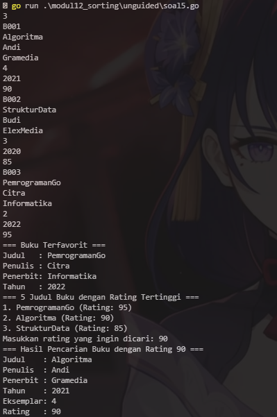

# <h1 align="center">Laporan Praktikum Modul 12 Pengurutan Data</h1>
<p align="center">Wahyu Widodo - 103112430011</p>

## Dasar Teori

Pengurutan data (sorting) adalah proses menyusun elemen-elemen data dalam urutan tertentu, biasanya kecil ke besar (ascending) atau dari besar ke kecil (descending), berdasarkan nilai tertentu seperti angka.

<br>
## Guided
### Soal 1
Diberikan `n` bilangan bulat positif. Buat program untuk mengurutkan angka ganjil secara **membesar (ascending)** dan angka genap secara **mengecil (descending)**, lalu gabungkan hasilnya dengan ganjil duluan.

Gunakan **selection sort** dalam proses pengurutan.

**Masukan:**

- Baris pertama berisi bilangan bulat `n` (1 ≤ n ≤ 100).
- Baris kedua berisi `n` bilangan bulat positif.

**Keluaran:**

- Satu baris berisi angka ganjil terurut membesar diikuti angka genap terurut mengecil.

**Contoh Masukan:**

```
10
12 7 3 2 9 6 8 1 11 4
```

**Contoh Keluaran:**

```
1 3 7 9 11 12 8 6 4 2
```

```go
package main

import "fmt"

func selectionSortAsc(arr []int, panjang int) {
	var temp, i, j, idxMin int
	for i = 0; i < panjang-1; i++ {
		idxMin = i
		for j = i + 1; j < panjang; j++ {
			if arr[j] < arr[idxMin] {
				idxMin = j
			}
		}
		temp = arr[idxMin]
		arr[idxMin] = arr[i]
		arr[i] = temp
	}
}

func selectionSortDesc(arr []int, panjang int) {
	var temp, i, j, idxMax int
	for i = 0; i < panjang-1; i++ {
		idxMax = i
		for j = i + 1; j < panjang; j++ {
			if arr[j] > arr[idxMax] {
				idxMax = j
			}
		}
		temp = arr[idxMax]
		arr[idxMax] = arr[i]
		arr[i] = temp
	}
}

func main() {
	n := 10
	numbers := []int{12, 7, 3, 2, 9, 6, 8, 1, 11, 4}

	var ganjil []int
	var genap []int

	for i := 0; i < n; i++ {
		if numbers[i]%2 == 1 {
			ganjil = append(ganjil, numbers[i])
		} else {
			genap = append(genap, numbers[i])
		}
	}

	selectionSortAsc(ganjil, len(ganjil))
	selectionSortDesc(genap, len(genap))

	for i := 0; i < len(ganjil); i++ {
		fmt.Print(ganjil[i], " ")
	}
	for i := 0; i < len(genap); i++ {
		fmt.Print(genap[i], " ")
	}
}


```

> Output <br>
> 

Program ini melakukan pengurutan data genap urut membesar jika ganjil urut mengecil. Lalu membuat 2 prosedur selectionSortAsc dan selectionDesc lalu dimain program nya membuat array yg akan di urutkan lalu panggil kedua prosedur selectionSort. lalu lakukan perulangan untuk menampilkan semua hasil pengurutan

<br>
### Soal 2
Sebuah kelas memiliki sejumlah siswa yang telah mengikuti ujian. Tugas Anda adalah membuat program yang membaca nilai-nilai ujian siswa dengan struct berisikan `nim` dan `nilai`, lalu mengurutkannya dari yang tertinggi ke yang terendah menggunakan **insertion sort**.

**Masukan:**

- Baris pertama adalah sebuah bilangan bulat `n` (1 ≤ n ≤ 100), menyatakan jumlah siswa.
- Baris berikutnya berisi `n` bilangan bulat yang masing-masing adalah nilai ujian (0–100).
   
**Keluaran:**

- Satu baris berisi nilai-nilai yang sudah terurut dari terbesar ke terkecil.

**Contoh Masukan:**

```
6
75 60 90 80 100 65
```

**Contoh Keluaran:**

```
100 90 80 75 65 60
```


```go
package main

import "fmt"

type Siswa struct {
	NIM   string
	Nilai int
}

func insertionSortDesc(arr []Siswa, panjang int) {
	var temp Siswa
	var i, j int

	for i = 1; i < panjang; i++ {
		temp = arr[i]
		j = i

		for j > 0 && temp.Nilai > arr[j-1].Nilai {
			arr[j] = arr[j-1]
			j--
		}

		arr[j] = temp
	}
}

func main() {
	var dataSiswa = []Siswa{
		{"22001", 75},
		{"22002", 60},
		{"22003", 90},
		{"22004", 80},
		{"22005", 100},
		{"22006", 65},
	}

	insertionSortDesc(dataSiswa, len(dataSiswa))
	for i := 0; i < len(dataSiswa); i++ {
		fmt.Print(dataSiswa[i].Nilai, " ")
	}
}

```

> Output <br>
> 

Program ini melakukan pengurutan data menggunakan insertionSort dengan terbesar ke kecil. disini menggunakan 1 prosedur yaitu insertionSortDesc dan struct untuk menyimpan variable yg akan digunakan. didalam main program terdapat inisialisasi data yg dimasukan ke array lalu panggil prosedur insertionSortDesc lalu lakukan perulangan untuk menampilkan hasil nya
<br>
## Unguided

### Soal 1

Hercules, preman terkenal seantero ibukota, memiliki kerabat di banyak daerah. Tentunya 
Hercules sangat suka mengunjungi semua kerabatnya itu.
Diberikan masukan nomor rumah dari semua kerabatnya di suatu daerah, buatlah program 
rumahkerabat yang akan menyusun nomor-nomor rumah kerabatnya secara terurut 
membesar menggunakan algoritma selection sort. 
Masukan dimulai dengan sebuah integer 𝒏 (0 < n < 1000), banyaknya daerah kerabat 
Hercules tinggal. Isi 𝒏 baris berikutnya selalu dimulai dengan sebuah integer 𝒎 (0 < m < 
1000000) yang menyatakan banyaknya rumah kerabat di daerah tersebut, diikuti dengan 
rangkaian bilangan bulat positif, nomor rumah para kerabat.
Keluaran terdiri dari n baris, yaitu rangkaian rumah kerabatnya terurut membesar di masingmasing daerah

```go
package main

import "fmt"

func selectionSort(arr []int) {
	n := len(arr)
	for i := 0; i < n-1; i++ {
		minIdx := i
		for j := i + 1; j < n; j++ {
			if arr[j] < arr[minIdx] {
				minIdx = j
			}
		}
		arr[i], arr[minIdx] = arr[minIdx], arr[i]
	}
}

func main() {
	var n int
	fmt.Scan(&n)

	results := make([][]int, n)

	for i := 0; i < n; i++ {
		var m int
		fmt.Scan(&m)

		rumah := make([]int, m)
		for j := 0; j < m; j++ {
			fmt.Scan(&rumah[j])
		}

		selectionSort(rumah)
		results[i] = rumah
	}

	for i := 0; i < n; i++ {
		for j := 0; j < len(results[i]); j++ {
			if j > 0 {
				fmt.Print(" ")
			}
			fmt.Print(results[i][j])
		}
		fmt.Println()
	}
}

```

> Output <br>
> 

Program ini digunakan untuk menyusun nomor-nomor rumah kerabatnya secara terurut 
membesar menggunakan algoritma selection sort. disini ada1 fungsi yaitu selectionSort untuk mengurutkan data nya. lalu di main program membuat array untuk menyimpan hasil dari fungsi selectionSort yg akan di tampilkan ke pengguna
<br>
### Soal 2

Belakangan diketahui ternyata Hercules itu tidak berani menyeberang jalan, maka selalu 
diusahakan agar hanya menyeberang jalan sesedikit mungkin, hanya diujung jalan. Karena 
nomor rumah sisi kiri jalan selalu ganjil dan sisi kanan jalan selalu genap, maka buatlah 
program kerabat dekat yang akan menampilkan nomor rumah mulai dari nomor yang ganjil 
lebih dulu terurut membesar dan kemudian menampilkan nomor rumah dengan nomor 
genap terurut mengecil. 
Format Masukan masih persis sama seperti sebelumnya.
Keluaran terdiri dari n baris, yaitu rangkaian rumah kerabatnya terurut membesar untuk 
nomor ganjil, diikuti dengan terurut mengecil untuk nomor genap, di masing-masing daerah.
No Masukan Keluaran
1 3
5 2 1 7 9 13
6 189 15 27 39 75 133 
3 4 9 1
1 13 12 8 2
15 27 39 75 133 189
8 4 2

```go
package main

import "fmt"

func selectionSortAsc(arr []int) {
	n := len(arr)
	for i := 0; i < n-1; i++ {
		minIdx := i
		for j := i + 1; j < n; j++ {
			if arr[j] < arr[minIdx] {
				minIdx = j
			}
		}
		arr[i], arr[minIdx] = arr[minIdx], arr[i]
	}
}

func selectionSortDesc(arr []int) {
	n := len(arr)
	for i := 0; i < n-1; i++ {
		maxIdx := i
		for j := i + 1; j < n; j++ {
			if arr[j] > arr[maxIdx] {
				maxIdx = j
			}
		}
		arr[i], arr[maxIdx] = arr[maxIdx], arr[i]
	}
}

func main() {
	var n int
	fmt.Scan(&n) 
	for i := 0; i < n; i++ {
		var count int
		fmt.Scan(&count) 

		rumah := make([]int, count)
		for j := 0; j < count; j++ {
			fmt.Scan(&rumah[j])
		}

		var ganjil, genap []int
		for _, x := range rumah {
			if x%2 == 1 {
				ganjil = append(ganjil, x)
			} else {
				genap = append(genap, x)
			}
		}

		selectionSortAsc(ganjil)
		selectionSortDesc(genap)

		for _, x := range ganjil {
			fmt.Printf("%d ", x)
		}
		for _, x := range genap {
			fmt.Printf("%d ", x)
		}
		fmt.Println()
	}
}


```

> Output <br>
> 

Program ini mengurtkan descending atau ascending diaray ganjil dan genap menggunakan selection sort. terdapat 2 fungsi selection sort ada yg descending dan ada yg ascending lalu panggil 2 fungsi itu di main program.
<br>

### Soal 3

Kompetisi pemrograman yang baru saja berlalu diikuti oleh 17 tim dari berbagai perguruan 
tinggi ternama. Dalam kompetisi tersebut, setiap tim berlomba untuk menyelesaikan 
sebanyak mungkin problem yang diberikan. Dari 13 problem yang diberikan, ada satu 
problem yang menarik. Problem tersebut mudah dipahami, hampir semua tim mencoba 
untuk menyelesaikannya, tetapi hanya 3 tim yang berhasil. Apa sih problemnya?
"Median adalah nilai tengah dari suatu koleksi data yang sudah terurut. Jika jumlah data 
genap, maka nilai median adalah rerata dari kedua nilai tengahnya. Pada problem ini, semua 
data merupakan bilangan bulat positif, dan karenanya rerata nilai tengah dibulatkan ke 
bawah."
Buatlah program median yang mencetak nilai median terhadap seluruh data yang sudah 
terbaca, jika data yang dibaca saat itu adalah 0.
Masukan berbentuk rangkaian bilangan bulat. Masukan tidak akan berisi lebih dari 1000000 
data, tidak termasuk bilangan 0. Data 0 merupakan tanda bahwa median harus dicetak, tidak 
termasuk data yang dicari mediannya. Data masukan diakhiri dengan bilangan bulat -5313.
Keluaran adalah median yang diminta, satu data per baris

```go
package main

import "fmt"

func selectionSort(arr []int) {
	n := len(arr)
	for i := 0; i < n-1; i++ {
		minIdx := i
		for j := i + 1; j < n; j++ {
			if arr[j] < arr[minIdx] {
				minIdx = j
			}
		}
		arr[i], arr[minIdx] = arr[minIdx], arr[i]
	}
}

func findMedian(arr []int) int {
	n := len(arr)
	if n%2 == 1 {
		return arr[n/2]
	} else {
		return (arr[n/2-1] + arr[n/2]) / 2
	}
}

func main() {
	var data []int
	var num int

	for {
		fmt.Scan(&num)

		if num == -5313 {
			break
		}

		if num != 0 {
			data = append(data, num)
		} else {
			selectionSort(data)
			median := findMedian(data)
			fmt.Println(median)
		}
	}
}


```

> Output <br>
> 

Program ini menghitung median menggunakan selection sort. yg dimana diakhiri dengan negatif. lalu disini terdapat 2 fungsi yg pertama selectionSort untuk mengurutkan dulu lalu fungsi yg kedua findMedian untuk mencari nilai median nya berapa
<br>


### Soal 4

Buatlah sebuah program yang digunakan untuk membaca data integer seperti contoh yang 
diberikan di bawah ini, kemudian diurutkan (menggunakan metoda insertion sort), dan 
memeriksa apakah data yang terurut berjarak sama terhadap data sebelumnya.
Masukan terdiri dari sekumpulan bilangan bulat yang diakhiri oleh bilangan negatif. Hanya 
bilangan non negatif saja yang disimpan ke dalam array.
Keluaran terdiri dari dua baris. Baris pertama adalah isi dari array setelah dilakukan 
pengurutan, sedangkan baris kedua adalah status jarak setiap bilangan yang ada di dalam 
array. "Data berjarak x" atau "data berjarak tidak tetap

```go
package main

import "fmt"

func main() {
	data := bacaInput()
	insertionSort(data)
	tampilkanData(data)
	tampilkanStatusJarak(data)
}

func bacaInput() []int {
	var input int
	var data []int

	for {
		fmt.Scan(&input)
		if input < 0 {
			break
		}
		data = append(data, input)
	}
	return data
}

func insertionSort(arr []int) {
	var i, j, key int
	for i = 1; i < len(arr); i++ {
		key = arr[i]
		j = i - 1
		for j >= 0 && arr[j] > key {
			arr[j+1] = arr[j]
			j--
		}
		arr[j+1] = key
	}
}

func tampilkanData(arr []int) {
	for i := 0; i < len(arr); i++ {
		fmt.Printf("%d ", arr[i])
	}
	fmt.Println()
}

func tampilkanStatusJarak(arr []int) {
	if len(arr) < 2 {
		fmt.Println("Data berjarak tidak tetap")
		return
	}

	jarak := arr[1] - arr[0]
	for i := 2; i < len(arr); i++ {
		if arr[i]-arr[i-1] != jarak {
			fmt.Println("Data berjarak tidak tetap")
			return
		}
	}
	fmt.Printf("Data berjarak %d\n", jarak)
}

```

> Output <br>
> 

Program ini untuk mengurutkan (menggunakan metoda insertion sort), dan 
memeriksa apakah data yang terurut berjarak sama terhadap data sebelumnya.

<br>

### Soal 5

Sebuah program perpustakaan digunakan untuk mengelola data buku di dalam suatu 
perpustakaan. Misalnya terdefinisi struct dan array seperti berikut ini:
const nMax : integer = 7919
type Buku = < 
 id, judul, penulis, penerbit : string
 eksemplar, tahun, rating : integer >
type DaftarBuku = array [ 1..nMax] of Buku
Pustaka : DaftarBuku
nPustaka: integer
Masukan terdiri dari beberapa baris. Baris pertama adalah bilangan bulat N yang 
menyatakan banyaknya data buku yang ada di dalam perpustakaan. N baris berikutnya, 
masing-masingnya adalah data buku sesuai dengan atribut atau field pada struct. Baris 
terakhir adalah bilangan bulat yang menyatakan rating buku yang akan dicari.
Halaman 9 | M o d u l P r a k t i k u m A l g o r i t m a P e m r o g r a m a n
Keluaran terdiri dari beberapa baris. Baris pertama adalah data buku terfavorit, baris kedua 
adalah lima judul buku dengan rating tertinggi, selanjutnya baris terakhir adalah data buku 
yang dicari sesuai rating yang diberikan pada masukan baris terakhir.

```go
package main

import (
	"fmt"
)

const nMax = 7919

type Buku struct {
	id, judul, penulis, penerbit string
	eksemplar, tahun, rating     int
}

type DaftarBuku [nMax]Buku

func DaftarkanBuku(pustaka *DaftarBuku, n *int) {
	fmt.Scanln(n)
	for i := 0; i < *n; i++ {
		fmt.Scanln(&pustaka[i].id)
		fmt.Scanln(&pustaka[i].judul)
		fmt.Scanln(&pustaka[i].penulis)
		fmt.Scanln(&pustaka[i].penerbit)
		fmt.Scanln(&pustaka[i].eksemplar)
		fmt.Scanln(&pustaka[i].tahun)
		fmt.Scanln(&pustaka[i].rating)
	}
}

func CetakTerfavorit(pustaka DaftarBuku, n int) {
	maxIdx := 0
	for i := 1; i < n; i++ {
		if pustaka[i].rating > pustaka[maxIdx].rating {
			maxIdx = i
		}
	}
	fmt.Println("=== Buku Terfavorit ===")
	fmt.Println("Judul   :", pustaka[maxIdx].judul)
	fmt.Println("Penulis :", pustaka[maxIdx].penulis)
	fmt.Println("Penerbit:", pustaka[maxIdx].penerbit)
	fmt.Println("Tahun   :", pustaka[maxIdx].tahun)
}

func UrutBuku(pustaka *DaftarBuku, n int) {
	for i := 1; i < n; i++ {
		temp := pustaka[i]
		j := i - 1
		for j >= 0 && pustaka[j].rating < temp.rating {
			pustaka[j+1] = pustaka[j]
			j--
		}
		pustaka[j+1] = temp
	}
}

func Cetak5Terbaru(pustaka DaftarBuku, n int) {
	batas := 5
	if n < 5 {
		batas = n
	}
	fmt.Println("=== 5 Judul Buku dengan Rating Tertinggi ===")
	for i := 0; i < batas; i++ {
		fmt.Printf("%d. %s (Rating: %d)\n", i+1, pustaka[i].judul, pustaka[i].rating)
	}
}

func CariBuku(pustaka DaftarBuku, n, r int) {
	kiri := 0
	kanan := n - 1
	found := false
	var mid int

	for kiri <= kanan && !found {
		mid = (kiri + kanan) / 2
		if pustaka[mid].rating == r {
			found = true
		} else if pustaka[mid].rating < r {
			kanan = mid - 1
		} else {
			kiri = mid + 1
		}
	}

	fmt.Println("=== Hasil Pencarian Buku dengan Rating", r, "===")
	if found {
		fmt.Println("Judul    :", pustaka[mid].judul)
		fmt.Println("Penulis  :", pustaka[mid].penulis)
		fmt.Println("Penerbit :", pustaka[mid].penerbit)
		fmt.Println("Tahun    :", pustaka[mid].tahun)
		fmt.Println("Eksemplar:", pustaka[mid].eksemplar)
		fmt.Println("Rating   :", pustaka[mid].rating)
	} else {
		fmt.Println("Tidak ada buku dengan rating seperti itu.")
	}
}

func main() {
	var pustaka DaftarBuku
	var n, ratingDicari int

	DaftarkanBuku(&pustaka, &n)
	CetakTerfavorit(pustaka, n)
	UrutBuku(&pustaka, n)
	Cetak5Terbaru(pustaka, n)

	fmt.Print("Masukkan rating yang ingin dicari: ")
	fmt.Scanln(&ratingDicari)
	CariBuku(pustaka, n, ratingDicari)
}

```

> Output <br>
> 

Program ini digunakan untuk memetakan buku yg ada diperpustakaan menggunakan insertion sort .
<br>
