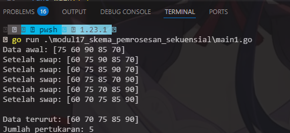
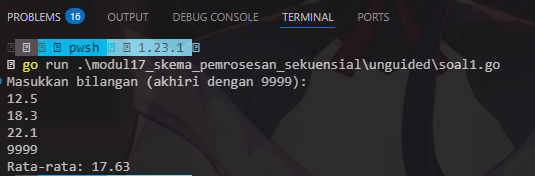
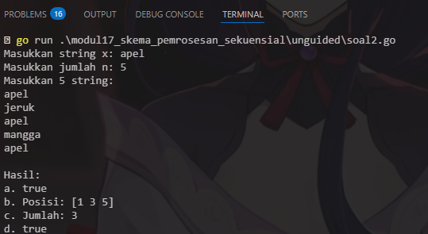
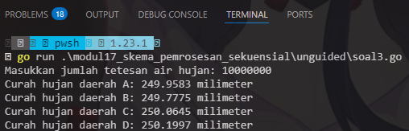
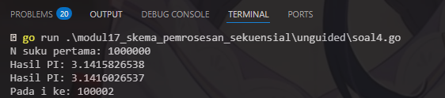
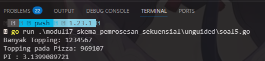

# <h1 align="center">Laporan Praktikum Modul 17 Skema Pemrosesan Sekuensial</h1>
<p align="center">Wahyu Widodo - 103112430011</p>

## Dasar Teori

Skema pemrosesan sekuensial (_sequential processing_) adalah paradigma pemrosesan data di mana operasi dilakukan secara berurutan, langkah demi langkah, sesuai urutan instruksi yang ditentukan. Konsep ini fundamental dalam pemrograman dan komputasi.
<br>
## Guided
### Soal 1
Aldi memiliki daftar nilai ulangan matematika temannya: 75, 60, 90, 85, dan 70. Ia ingin mengurutkan nilai tersebut dari yang terkecil ke yang terbesar menggunakan **metode Bubble Sort**.

**Pertanyaan:**

1. Tunjukkan proses pengurutan nilai menggunakan Bubble Sort **hingga semua nilai terurut.**
2. Berapa kali pertukaran (swap) terjadi dalam proses ini?

```go
package main

import "fmt"

func bubbleSort(data []int) ([]int, int) {
	n := len(data)
	swap := 0
	for i := 0; i < n-1; i++ {
		for j := 0; j < n-1-i; j++ {
			if data[j] > data[j+1] {
				data[j], data[j+1] = data[j+1], data[j]
				swap++
				fmt.Println("Setelah swap:", data)
			}
		}
	}
	return data, swap
}

func main() {
	nilai := []int{75, 60, 90, 85, 70}
	fmt.Println("Data awal:", nilai)

	hasil, jumlahSwap := bubbleSort(nilai)

	fmt.Println("\nData terurut:", hasil)
	fmt.Println("Jumlah pertukaran:", jumlahSwap)
}

```

> Output <br>
> 

Program ini melakukan pengurutan data menggunakan bubble sort. didalam fungsi bubbleSort mengembalikan data yg udh terutut dan data jumlah pertukaran yg sudah dihitung didlam fungsi bubble sort lalu dipanggil di main program kemudian di tampilkan hasilnya.
<br>
## Unguided

### Soal 1

Diberikan sejumlah bilangan real yang diakhiri dengan marker 9999, cari rerata dari bilangan
bilangan tersebut.

```go
package main

import "fmt"

func main() {
	var total float64
	var jumlahBilangan int
	var bilangan float64

	fmt.Println("Masukkan bilangan (akhiri dengan 9999):")

	for {
		fmt.Scan(&bilangan)
		if bilangan == 9999 {
			break
		}
		total += bilangan
		jumlahBilangan++
	}

	if jumlahBilangan == 0 {
		fmt.Println("Error: Tidak ada bilangan yang dimasukkan!")
	} else {
		rataRata := total / float64(jumlahBilangan)
		fmt.Printf("Rata-rata: %.2f\n", rataRata)
	}
}

```

> Output <br>
> 

Program ini digunakan untuk menghitung rata rata dengan inputan pengguna yg di akhiri dengan 9999. Disini menggunakan perungan for jika bilngan yg dinput user adalah 9999 maka perulangan berhenti. Lalu tampilan rata rata nya.<br>
### Soal 2

Diberikan string x dan n buah string. x adalah data pertama yang dibaca, n adalah data 
bilangan yang dibaca kedua, dan n data berikutnya adalah data string. Buat algoritma untuk 
menjawab pertanyaan berikut:
a. Apakah string x ada dalam kumpulan n data string tersebut?
b. Pada posisi ke berapa string x tersebut ditemukan?
c. Ada berapakah string x dalam kumpulan n data string tersebut?
d. Adakah sedikitnya dua string x dalam n data string tersebut?

```go
package main

import "fmt"

func main() {
	var x string
	var n int
	var data string
	var found bool = false
	var positions []int
	var count int = 0

	fmt.Print("Masukkan string x: ")
	fmt.Scanln(&x)
	fmt.Print("Masukkan jumlah n: ")
	fmt.Scanln(&n)

	fmt.Printf("Masukkan %d string:\n", n)
	for i := 0; i < n; i++ {
		fmt.Scanln(&data)
		if data == x {
			found = true
			count++
			positions = append(positions, i+1)
		}
	}

	fmt.Println("\nHasil:")
	fmt.Printf("a. %v\n", found)

	if found {
		fmt.Printf("b. Posisi: %v\n", positions)
	} else {
		fmt.Println("b. -")
	}

	fmt.Printf("c. Jumlah: %d\n", count)
	fmt.Printf("d. %v\n", count >= 2)
}

```

> Output <br>
> 

Program ini menghitung string, trs menentukan posisi, lalu menghitung jumlah total kemunculan dan apakah jumlah kemunculan <= 2 maka true disini menggunakan for / perulangan. 
<br>

### Soal 3

Empat daerah A, B, C, dan D yang berdekatan ingin mengukur curah hujan. Keempat daerah 
tersebut digambarkan pada bidang berikut:
Misal curah hujan dihitung berdasarkan banyaknya tetesan air hujan. Setiap tetesan 
berukuran 0.0001 ml curah hujan. Tetesan air hujan turun secara acak dari titik (0,0) sampai 
(1,1). Jika diterima input yang menyatakan banyaknya tetesan air hujan. Tentukan curah 
hujan untuk keempat daerah tersebut.
Buatlah program yang menerima input berupa banyaknya tetesan air hujan. Kemudian buat 
koordinat/titik (x, y) secara acak dengan menggunakan fungsi rand.Float64(). Hitung dan 
tampilkan banyaknya tetesan yang jatuh pada daerah A, B, C dan D. Konversikan satu tetesan 
berukuran 0.0001 milimeter.
Catatan: Lihat lampiran untuk informasi menggunakan paket math/rand untuk menggunakan 
rand.Float64() yang menghasilkan bilangan riil acak [0..1].
Berikut contoh masukan dan keluarannya:
No Masukan Keluaran
1 10000000 Curah hujan daerah A: 250.0066 milimeter
Curah hujan daerah B: 249.8981 milimeter
Curah hujan daerah C: 249.9930 milimeter
Curah hujan daerah D: 250.1023 milimeter

```go
package main

import (
	"fmt"
	"math/rand"
	"time"
)

func main() {
	var a, b, c, d int
	var tetesan int
	rand.Seed(time.Now().UnixNano())
	fmt.Print("Masukkan jumlah tetesan air hujan: ")
	fmt.Scanln(&tetesan)


	for i := 0; i < tetesan; i++ {
		x := rand.Float64()
		y := rand.Float64()

		if x < 0.5 && y < 0.5 {
			a++
		} else if x >= 0.5 && y < 0.5 {
			b++
		} else if x < 0.5 && y >= 0.5 {
			c++
		} else {
			d++
		}
	}

	curahA := float64(a) * 0.0001
	curahB := float64(b) * 0.0001
	curahC := float64(c) * 0.0001
	curahD := float64(d) * 0.0001

	fmt.Printf("Curah hujan daerah A: %.4f milimeter\n", curahA)
	fmt.Printf("Curah hujan daerah B: %.4f milimeter\n", curahB)
	fmt.Printf("Curah hujan daerah C: %.4f milimeter\n", curahC)
	fmt.Printf("Curah hujan daerah D: %.4f milimeter\n", curahD)
}
```

> Output <br>
> 

Program ini menghitung curah hujan menggunakan library math/rand dan time lalu menggunakan for perlangan untuk menghitung keseluruhan nya. 


<br>
### Soal 4

Berdasarkan formula Leibniz, nilai π dapat dinyatakan sebagai deret harmonik ganti sebagai 
berikut:

Berdasarkan rumus tersebut, buatlah program yang menghitung 𝑆 untuk 1000000 suku 
pertama.
Perhatikan contoh sesi interaksi program di bawah ini (teks bergaris bawah adalah 
input/read):
N suku pertama: 1000000
Hasil PI: 3.1415951
Setelah jalan, modifikasi program tersebut agar menyimpan nilai dua suku yang 
bersebelahan, 𝑆𝑖 dan 𝑆𝑖+1. Buatlah agar program tersebut sekarang berhenti apabila selisih 
dari kedua suku tersebut tidak lebih dari 0.00001.
Perhatikan contoh sesi interaksi program di bawah ini (teks bergaris bawah adalah 
input/read):
N suku pertama: 1000000
Hasil PI: 3.1415876535
Hasil PI: 3.1415976535
Pada i ke: 200002

```go
package main

import (
	"fmt"
	"math"
)

func main() {
	var N int
	fmt.Print("N suku pertama: ")
	fmt.Scanln(&N)

	S := 0.0
	prevSuku := 0.0
	i := 1
	for ; i <= N; i++ {
		suku := 1.0 / (2.0*float64(i) - 1.0)
		if i%2 == 0 {
			suku *= -1
		}
		S += suku

		if i > 1 && math.Abs(suku-prevSuku) <= 0.00001 {
			break
		}
		prevSuku = suku
	}

	pi := 4 * S
	fmt.Printf("Hasil PI: %.10f\n", pi)
	fmt.Printf("Hasil PI: %.10f\n", pi+4*prevSuku)
	fmt.Printf("Pada i ke: %d\n", i)
}

```

> Output <br>
> 

Program ini untuk digunakan menghitung deret harmonik seperti biasa menggunakan perulangan kemudian berhenti ketika selisih dari kedua suku tersebut tidak lebih dari 0.00001. 
<br>

### Soal 5

Monti bekerja pada sebuah kedai pizza, saking ramainya kedai tersebut membuat Monti tidak 
ada waktu untuk bersantai. Suatu ketika saat sedang menaburkan topping pada pizza yang 
diletakkan pada wadah berbentuk persegi, terpikirkan oleh Monti cara menghitung berapa 
banyak topping yang dia butuhkan, dan cara menghitung nilai 𝝅.
Ilustrasi seperti gambar yang diberikan di bawah, topping adalah lingkaran-lingkaran kecil. 
Ada yang tepat berada di atas pizza, dan ada yang jatuh di dalam kotak tetapi berada di luar 
pizza. Apabila luas pizza yang memiliki radius r adalah 𝐿𝑢𝑎𝑠𝑃𝑖𝑧𝑧𝑎 = 𝜋𝑟
2 dan luas wadah pizza yang 
memiliki panjang sisi 𝑑 = 2𝑟 adalah 𝐿𝑢𝑎𝑠𝑊𝑎𝑑𝑎ℎ = 𝑑
2 = 4𝑟
2
, maka diperoleh perbandingan 
luas kedua bidang tersebut
𝐿𝑢𝑎𝑠𝑃𝑖𝑧𝑧𝑎
𝐿𝑢𝑎𝑠𝑊𝑎𝑑𝑎ℎ
=
𝜋𝑟
2
4𝑟
2 =
𝜋
4
Persamaan lingkaran adalah (𝑥 − 𝑥𝑐)
2 + (𝑦 − 𝑦𝑐)
2 = 𝑟
2 dengan titik pusat lingkaran adalah 
(𝑥𝑐
, 𝑦𝑐). Suatu titik sembarang (𝑥, 𝑦) dikatakan berada di dalam lingkaran apabila memenuhi 
ketidaksamaan:
(𝑥 − 𝑥𝑐)
2 + (𝑦 − 𝑦𝑐)
2 ≤ 𝑟
2
Pada ilustrasi topping berbentuk bulat kecil merah dan biru pada gambar adalah titik-titik 
(𝑥, 𝑦) acak pada sebuah wadah yang berisi pizza. Dengan jumlah yang sangat banyak dan 
ditaburkan merata (secara acak), maka kita bisa mengetahui berapa banyak titik/topping yang 
berada tepat di dalam pizza menggunakan ketidaksamaan di atas.
Buatlah program yang menerima input berupa banyaknya topping yang akan ditaburkan, 
kemudian buat titik acak (𝑥, 𝑦) dari bilangan acak riil pada kisaran nilai 0 hingga 1 sebanyak 
topping yang diberikan. Hitung dan tampilkan berapa banyak topping yang jatuh tepat di atas 
pizza.
Titik pusat pizza adalah (0.5, 0.5) dan jari-jari pizza adalah 0.5 satuan wadah.
Perhatikan contoh sesi interaksi program di bawah ini (teks bergaris bawah adalah 
input/read) : Banyak Topping: 1234567
Topping pada Pizza: 969000
Banyak Topping: 10000000
Topping pada Pizza: 7856565
Apabila topping yang ditaburkan oleh Monti secara merata berjumlah yang sangat banyak, 
maka topping akan menutupi keseluruhan wadah pizza. Luas Pizza sebanding dengan topping 
yang berada pada pizza, sedangkan Luas Wadah sebanding dengan banyaknya topping yang 
ditaburkan. Dengan menggunakan rumus perbandingan luas yang diberikan di atas, maka nilai 
konstanta 𝜋 dapat dihitung.
Modifikasi program di atas sehingga dapat menghitung dan menampilkan nilai konstanta π.
Perhatikan contoh sesi interaksi program di bawah ini (teks bergaris bawah adalah 
input/read) Banyak Topping: 1234567
Topping pada Pizza: 969206
PI : 3.1402297324
Banyak Topping: 10
Topping pada Pizza: 5
PI : 2.0000000000
Banyak Topping: 256
Topping pada Pizza: 198
PI : 3.0937500000
Banyak Topping: 5000
Topping pada Pizza: 3973
PI : 3.1784000000

```go
package main

import (
	"fmt"
	"math/rand"
	"time"
)

func main() {
	rand.Seed(time.Now().UnixNano())

	var totalTopping int
	fmt.Print("Banyak Topping: ")
	fmt.Scanln(&totalTopping)

	toppingDiPizza := 0
	xCenter, yCenter, radius := 0.5, 0.5, 0.5
	radiusSquared := radius * radius

	for i := 0; i < totalTopping; i++ {
		x := rand.Float64()
		y := rand.Float64()

		dx := x - xCenter
		dy := y - yCenter
		jarakSquared := dx*dx + dy*dy

		if jarakSquared <= radiusSquared {
			toppingDiPizza++
		}
	}

	pi := 4.0 * float64(toppingDiPizza) / float64(totalTopping)

	fmt.Printf("Topping pada Pizza: %d\n", toppingDiPizza)
	fmt.Printf("PI : %.10f\n", pi)
}

```

> Output <br>
> 

Program ini digunakan untuk penghitung banyak topping pada pizza menggunakan library rand dan time. terdapat perulangan for loop akan berhenti jika i < jumlah topping
<br>