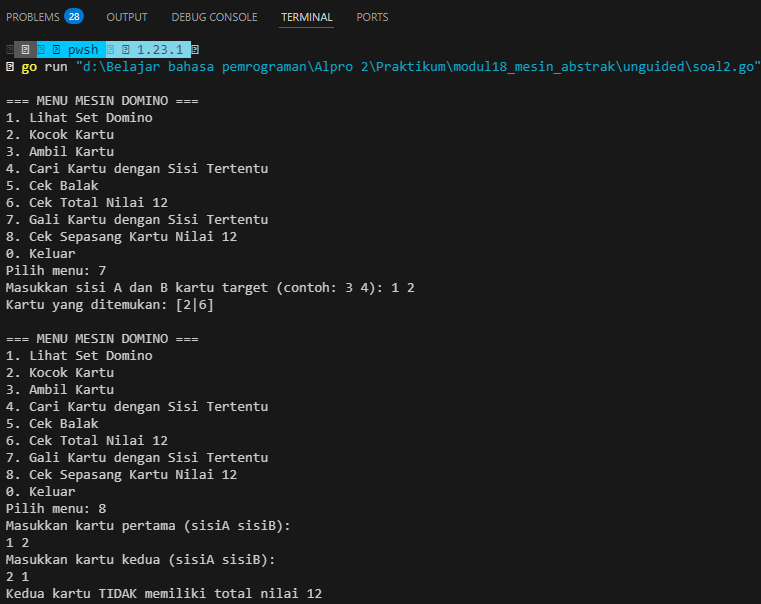

# <h1 align="center">Laporan Praktikum Modul 18 Mesin Abstrak</h1>
<p align="center">Wahyu Widodo - 103112430011</p>

## Dasar Teori

Mesin abstrak adalah bagian dari ilmu komputer yang digunakan untuk memodelkan perilaku komputasi dengan cara yang lebih formal dan sistematis. Mesin abstrak merupakan model konseptual dari komputer atau sistem komputasi yang membantu dalam analisis, perancangan, dan implementasi algoritma dalam bahasa pemrograman.
<br>
<br>
## Unguided

### Soal 1
Implementasi operasi dasar mesin domino sebagai sebuah subprogram:
a) Buat tipe data kartu domino (Domino) yang menyimpan informasi
	➢ gambar (suit) kedua sisi kartu
	➢ nilai kartu
	➢ Boolean data yang menyatakan kartu ini balak atau bukan
	➢ Buat tipe data satu set kartu domino (Dominoes)
	➢ Array menyimpan 28 kartu Domino
	➢ Jumlah kartu tersisa dalam array tersebut
b) prosedur kocokKartu(Dominoes)
c) fungsi ambilKartu(Dominoes) → Domino
d) fungsi gambarKartu(Domino,suit int) → int
e) fungsi nilaiKartu(Domino) → int

```go
package main

import (
	"fmt"
	"math/rand"
	"time"
)

type KartuDomino struct {
	SisiA    int
	SisiB    int
	Nilai    int
	IsBalak  bool
}

type SetDomino struct {
	Kartu    [28]KartuDomino
	Sisa     int
}


func BuatSetDominoBaru() SetDomino {
	var set SetDomino
	index := 0
	
	for i := 0; i <= 6; i++ {
		for j := i; j <= 6; j++ {
			set.Kartu[index] = KartuDomino{
				SisiA:   i,
				SisiB:   j,
				Nilai:   i + j,
				IsBalak: i == j,
			}
			index++
		}
	}
	
	set.Sisa = 28
	return set
}

func TampilkanSetDomino(set SetDomino) {
	fmt.Println("Set Domino:")
	for i := 0; i < set.Sisa; i++ {
		fmt.Printf("[%d|%d] ", set.Kartu[i].SisiA, set.Kartu[i].SisiB)
		if (i+1)%7 == 0 {
			fmt.Println()
		}
	}
	fmt.Println()
}

func KocokKartu(set *SetDomino) {
	rand.Seed(time.Now().UnixNano())
	for i := 0; i < set.Sisa; i++ {
		j := rand.Intn(set.Sisa)
		set.Kartu[i], set.Kartu[j] = set.Kartu[j], set.Kartu[i]
	}
}

func AmbilKartu(set *SetDomino) (KartuDomino, bool) {
	if set.Sisa == 0 {
		return KartuDomino{}, false
	}
	
	kartu := set.Kartu[set.Sisa-1]
	set.Sisa--
	return kartu, true
}

func CariDanTampilkanKartu(set SetDomino, sisi int) {
	fmt.Printf("Kartu dengan sisi %d:\n", sisi)
	jumlah := 0
	for i := 0; i < set.Sisa; i++ {
		kartu := set.Kartu[i]
		if kartu.SisiA == sisi || kartu.SisiB == sisi {
			fmt.Printf("[%d|%d] ", kartu.SisiA, kartu.SisiB)
			jumlah++
		}
	}
	if jumlah == 0 {
		fmt.Println("Tidak ditemukan kartu dengan sisi tersebut")
	}
	fmt.Println()
}

func main() {	
	var pilihan int
	var sisiDicari int
	var a, b int
	var a1, b1, a2, b2 int
	set := BuatSetDominoBaru()
	
	for {
		fmt.Println("\n=== MENU MESIN DOMINO ===")
		fmt.Println("1. Lihat Set Domino")
		fmt.Println("2. Kocok Kartu")
		fmt.Println("3. Ambil Kartu")
		fmt.Println("4. Cari Kartu dengan Sisi Tertentu")
		fmt.Println("5. Cek Balak")
		fmt.Println("6. Cek Total Nilai 12")
		fmt.Println("0. Keluar")
		fmt.Print("Pilih menu: ")
		fmt.Scan(&pilihan)

		switch pilihan {
		case 1:
			TampilkanSetDomino(set)
		case 2:
			KocokKartu(&set)
			fmt.Println("Kartu telah dikocok!")
		case 3:
			kartu, berhasil := AmbilKartu(&set)
			if berhasil {
				fmt.Printf("Kartu yang diambil: [%d|%d]\n", kartu.SisiA, kartu.SisiB)
				fmt.Printf("Nilai: %d, Balak: %v\n", kartu.Nilai, kartu.IsBalak)
			} else {
				fmt.Println("Tidak ada kartu tersisa!")
			}
		case 4:
			fmt.Print("Masukkan sisi yang dicari (0-6): ")
			fmt.Scan(&sisiDicari)
			if sisiDicari < 0 || sisiDicari > 6 {
				fmt.Println("Sisi harus antara 0-6!")
				continue
			}
			CariDanTampilkanKartu(set, sisiDicari)
		case 5:
			fmt.Print("Masukkan sisi A dan B kartu (contoh: 3 3): ")
			fmt.Scan(&a, &b)
			isBalak := a == b
			fmt.Printf("Kartu [%d|%d] adalah balak? %v\n", a, b, isBalak)
		case 6:
			fmt.Println("Masukkan kartu pertama (sisiA sisiB): ")
			fmt.Scan(&a1, &b1)
			fmt.Println("Masukkan kartu kedua (sisiA sisiB): ")
			fmt.Scan(&a2, &b2)
			total := (a1 + b1) + (a2 + b2)
			fmt.Printf("Total nilai: %d (12? %v)\n", total, total == 12)
		case 0:
			fmt.Println("Terima kasih telah bermain domino!")
			return
		default:
			fmt.Println("Pilihan tidak valid!")
		}
	}
}
```

> Output <br>
> 

Program ini mengimplementasi operasi dasar mesin domino. Disini terdapat 2 struct yaitu KartuDomino untuk menyimpan data kartu dan SetDomino untuk menyimpan kartu apa saja yg ingin di set. Lalu disini ada fungsi BuatSetDominoBaru. Lalu ada prosedur TampilkanSetDomino, KocokKartu, AmbilKartu, dan CariDanTampilkanKartu. Lalu di main program membuat Menu/pilihan menggunakan switch case. Kemudian pengguna memilih menu lalu program menjalankan sesuai apa yg dipilih pengguna.  

NOTE: Balak adalah  istilah dalam permainan domino untuk kartu yang memiliki kedua sisi dengan nilai yang sama. Contoh:
- [0|0] (balak nol)
- [1|1] (balak satu)
- [2|2] (balak dua)
<br>
### Soal 2
Realisasi aksi berikut menggunakan operasi-operasi dasar mesin domino:
a) prosedur galiKartu(Dominoes,Domino) yang mengambil kartu dari tumpukan sampai
diperoleh kartu dengan gambar (suit) yang sama dengan kartu yang diberikan
b) fungsi sepasangKartu(Domino,Domino) → boolean; yang memberikan nilai true jika total
nilai kartu adalah 12 dan false jika tidak.

```go
func galiKartu(set *SetDomino, kartuTarget KartuDomino) (KartuDomino, bool) {
    sisi1 := kartuTarget.SisiA
    sisi2 := kartuTarget.SisiB
    
    for set.Sisa > 0 {
        kartu, berhasil := AmbilKartu(set)
        if !berhasil {
            return KartuDomino{}, false
        }
        
        if kartu.SisiA == sisi1 || kartu.SisiA == sisi2 || 
           kartu.SisiB == sisi1 || kartu.SisiB == sisi2 {
            return kartu, true
        }
        
    }
    
    return KartuDomino{}, false
}

func sepasangKartu(kartu1 KartuDomino, kartu2 KartuDomino) bool {
    return (kartu1.Nilai + kartu2.Nilai) == 12
}

func main() {
    // ... (kode sebelumnya)
    
    // Tambahkan menu baru
    fmt.Println("7. Gali Kartu dengan Sisi Tertentu")
    fmt.Println("8. Cek Sepasang Kartu Nilai 12")
    
    switch pilihan {
        // ... (case-case sebelumnya)
        
        case 7:
            var a, b int
            fmt.Print("Masukkan sisi A dan B kartu target (contoh: 3 4): ")
            fmt.Scan(&a, &b)
            
            kartuTarget := KartuDomino{SisiA: a, SisiB: b}
            kartuDitemukan, berhasil := galiKartu(&set, kartuTarget)
            
            if berhasil {
                fmt.Printf("Kartu yang ditemukan: [%d|%d]\n", 
                    kartuDitemukan.SisiA, kartuDitemukan.SisiB)
            } else {
                fmt.Println("Tidak ditemukan kartu yang cocok!")
            }
            
        case 8:
            var a1, b1, a2, b2 int
            fmt.Println("Masukkan kartu pertama (sisiA sisiB): ")
            fmt.Scan(&a1, &b1)
            fmt.Println("Masukkan kartu kedua (sisiA sisiB): ")
            fmt.Scan(&a2, &b2)
            
            kartu1 := KartuDomino{SisiA: a1, SisiB: b1, Nilai: a1 + b1}
            kartu2 := KartuDomino{SisiA: a2, SisiB: b2, Nilai: a2 + b2}
            
            if sepasangKartu(kartu1, kartu2) {
                fmt.Println("Kedua kartu memiliki total nilai 12")
            } else {
                fmt.Println("Kedua kartu TIDAK memiliki total nilai 12")
            }
    }
}

```

> Output <br>
> 

Program ini adalah lanjutan dari program soal 1 yaitu menambah prosedur galiKartu untuk mengambil kartu dari tumpukan sampai diperoleh kartu dengan gambar (suit) yang sama dengan kartu yang diberikan dan fungsi sepasangKartu untuk mengecek nilai true jika total nilai kartu adalah 12 dan false jika tidak.

NOTE: Balak adalah  istilah dalam permainan domino untuk kartu yang memiliki kedua sisi dengan nilai yang sama. Contoh:
- [0|0] (balak nol)
- [1|1] (balak satu)
- [2|2] (balak dua)
<br>

### Soal 3
Implementasi salah satu permainan domino. Lihat lampiran untuk deskripsi permainan 
Gapleh.

```go
package main

import (
	"fmt"
	"math/rand"
	"time"
)

type KartuDomino struct {
	SisiA   int
	SisiB   int
	Nilai   int
	IsBalak bool
}

type SetDomino struct {
	Kartu [28]KartuDomino
	Sisa  int
}

type Pemain struct {
	Nama   string
	Kartu  [4]KartuDomino
	Total  int
	Menang bool
}

func main() {
	rand.Seed(time.Now().UnixNano())

	set := BuatSetDominoBaru()
	KocokKartu(&set)

	var jumlahPemain int
	fmt.Print("Masukkan jumlah pemain (2-4): ")
	fmt.Scan(&jumlahPemain)

	if jumlahPemain < 2 || jumlahPemain > 4 {
		fmt.Println("Jumlah pemain harus antara 2-4")
		return
	}

	pemain := make([]Pemain, jumlahPemain)
	for i := 0; i < jumlahPemain; i++ {
		fmt.Printf("Masukkan nama pemain %d: ", i+1)
		fmt.Scan(&pemain[i].Nama)
	}

	for i := 0; i < 4; i++ {
		for j := 0; j < jumlahPemain; j++ {
			kartu, _ := AmbilKartu(&set)
			pemain[j].Kartu[i] = kartu
			pemain[j].Total += kartu.Nilai
		}
	}

	for i := 0; i < jumlahPemain; i++ {
		fmt.Printf("\nKartu %s:\n", pemain[i].Nama)
		for j := 0; j < 4; j++ {
			fmt.Printf("[%d|%d] ", pemain[i].Kartu[j].SisiA, pemain[i].Kartu[j].SisiB)
		}
		fmt.Printf("\nTotal nilai: %d\n", pemain[i].Total)
	}

	maxTotal := 0
	indexPemenang := 0

	for i := 0; i < jumlahPemain; i++ {
		if pemain[i].Total > maxTotal {
			maxTotal = pemain[i].Total
			indexPemenang = i
		}
	}

	fmt.Printf("\nPemenangnya adalah %s dengan total nilai %d!\n",
		pemain[indexPemenang].Nama, pemain[indexPemenang].Total)

	for i := 0; i < jumlahPemain; i++ {
		if CekKembang(pemain[i].Kartu) {
			fmt.Printf("%s dapat KEMBANG!\n", pemain[i].Nama)
		}
		if CekBalakGanda(pemain[i].Kartu) {
			fmt.Printf("%s dapat BALAK GANDA!\n", pemain[i].Nama)
		}
	}
}

func BuatSetDominoBaru() SetDomino {
	var set SetDomino
	index := 0

	for i := 0; i <= 6; i++ {
		for j := i; j <= 6; j++ {
			set.Kartu[index] = KartuDomino{
				SisiA:   i,
				SisiB:   j,
				Nilai:   i + j,
				IsBalak: i == j,
			}
			index++
		}
	}

	set.Sisa = 28
	return set
}

func KocokKartu(set *SetDomino) {
	for i := 0; i < set.Sisa; i++ {
		j := rand.Intn(set.Sisa)
		set.Kartu[i], set.Kartu[j] = set.Kartu[j], set.Kartu[i]
	}
}

func AmbilKartu(set *SetDomino) (KartuDomino, bool) {
	if set.Sisa == 0 {
		return KartuDomino{}, false
	}

	kartu := set.Kartu[set.Sisa-1]
	set.Sisa--
	return kartu, true
}

func CekKembang(kartu [4]KartuDomino) bool {
	sisiPertama := kartu[0].SisiA
	for i := 0; i < 4; i++ {
		if kartu[i].SisiA != sisiPertama && kartu[i].SisiB != sisiPertama {
			return false
		}
	}
	return true
}

func CekBalakGanda(kartu [4]KartuDomino) bool {
	jumlahBalak := 0
	for i := 0; i < 4; i++ {
		if kartu[i].IsBalak {
			jumlahBalak++
		}
	}
	return jumlahBalak >= 2
}

```

> Output <br>
> 

Program ini adalah membuat mesin abstrak kiu kiu yg dimana hanya ada 2-4 pemain. Sama seperti sebelumnya ada fungsi domino lalu menambahkan aturan baru karena disini saya memilih kiu kiu maka aturan nya adalah:
1. Tujuan akhir adalah mendapatkan 4 kartu dengan total nilai tertinggi
2. Setiap pemain mendapat 4 kartu
3. Lalu melakukan perhitungan nilai. Nilai kartu ditentukan oleh jumlah titik kedua sisi lalu total nilai adalah jumlah nilai keempat kartu
4. Lalu ada kondisi yg dimana Kembang yg berarti semua kartu memiliki salah satu sisi yang sama. Lalu ada balak Ganda yg berarti memiliki setidaknya dua kartu balak

NOTE: Balak adalah  istilah dalam permainan domino untuk kartu yang memiliki kedua sisi dengan nilai yang sama. Contoh:
- [0|0] (balak nol)
- [1|1] (balak satu)
- [2|2] (balak dua)
<br>
### Soal 4
Implementasi mesin abstrak karakter yang bekerja terhadap untaian karakter (yang diakhiri 
dengan penanda titik (".") dan mempunyai sejumlah operasi dasar.
a) Operasi dasar mesin karakter:
➢ Prosedur start(); yang menyiapkan mesin karakter di awal rangkaian karakter.
➢ Prosedur maju(); yang memajukan pembaca ke posisi karakter berikutnya.
➢ Fungsi eop(); yang mengembalikan nilai true apabila sudah mencapai akhir 
rangkaian, sampai ke penanda titik (".").
➢ Fungsi cc(); yang mengembalikan karakter yang sedang terbaca, atau berada pada 
posisi pembacaan mesin.
b) Dengan operasi dasar di atas buat algoritma untuk:
➢ Membaca seluruh karakter yang diberikan ke mesin karakter tersebut.
➢ Menghitung berapa banyak karakter yang terbaca.
➢ Menghitung ada berapa huruf "A" yang terbaca.
➢ Menghitung frekuensi kemunculan huruf "A" terhadap seluruh karakter terbaca.
➢ Menghitung ada berapa kata "LE" (pasangan berturutan huruf "L" dan "E") yang 
terbaca.

```go
package main

import "fmt"
type MesinKarakter struct {
	teks    []rune
	posisi  int
	panjang int
}

func (m *MesinKarakter) Start(teks string) {
	m.teks = []rune(teks)
	m.posisi = 0
	m.panjang = len(m.teks)
}

func (m *MesinKarakter) Maju() {
	if m.posisi < m.panjang {
		m.posisi++
	}
}

func (m *MesinKarakter) EOP() bool {
	return m.posisi >= m.panjang || m.teks[m.posisi] == '.'
}

func (m *MesinKarakter) CC() rune {
	if m.EOP() {
		return 0
	}
	return m.teks[m.posisi]
}

func (m *MesinKarakter) BacaSeluruhKarakter() string {
	var hasil []rune
	for !m.EOP() {
		hasil = append(hasil, m.CC())
		m.Maju()
	}
	return string(hasil)
}

func (m *MesinKarakter) HitungJumlahKarakter() int {
	count := 0
	m.Start(string(m.teks))
	for !m.EOP() {
		count++
		m.Maju()
	}
	return count
}

func (m *MesinKarakter) HitungHurufA() int {
	count := 0
	m.Start(string(m.teks))
	for !m.EOP() {
		c := m.CC()
		if c == 'A' || c == 'a' {
			count++
		}
		m.Maju()
	}
	return count
}

func (m *MesinKarakter) HitungFrekuensiA() float64 {
	total := m.HitungJumlahKarakter()
	if total == 0 {
		return 0
	}
	jumlahA := m.HitungHurufA()
	return float64(jumlahA) / float64(total)
}

func (m *MesinKarakter) HitungKataLE() int {
	count := 0
	m.Start(string(m.teks))

	for !m.EOP() && m.posisi < m.panjang-1 {
		current := m.CC()
		next := m.teks[m.posisi+1]

		if (current == 'L' || current == 'l') && (next == 'E' || next == 'e') {
			count++
		}
		m.Maju()
	}
	return count
}

func main() {
	mesin := MesinKarakter{}
	input := "Saya suka matkul algoritma pemrograman dua le."
	mesin.Start(input)

	fmt.Println("Seluruh karakter:")
	fmt.Println(mesin.BacaSeluruhKarakter())
	fmt.Printf("\nJumlah karakter: %d\n", mesin.HitungJumlahKarakter())
	fmt.Printf("Jumlah huruf 'A': %d\n", mesin.HitungHurufA())
	fmt.Printf("Frekuensi huruf 'A': %.2f\n", mesin.HitungFrekuensiA())
	fmt.Printf("Jumlah pasangan 'LE': %d\n", mesin.HitungKataLE())
}

```

> Output <br>
> 

Program ini mengimplementasikan mesin karakter yang bekerja dengan untaian karakter diakhiri titik (".").  Disini terdapat operasi dasar Start() untuk menginisialisasi mesin dengan teks baru, Maju() untuk memindahkan posisi pembacaan ke karakter berikutnya, EOP() untuk mengecek apakah sudah mencapai akhir (titik), CC() untuk mengembalikan karakter pada posisi saat ini. Lalu ada operasi BacaSeluruhKarakter() untuk membaca semua karakter sampai titik, HitungJumlahKarakter() untuk menghitung total karakter, HitungHurufA() untuk menghitung kemunculan huruf 'A', HitungFrekuensiA() untuk menghitung rasio huruf A terhadap total karakter, dan HitungKataLE() untuk menghitung pasangan 'L' diikuti 'E'. 
